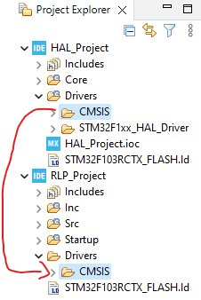

.. _sec_bare_metal_project:

Create an STM32 Bare Metal Project
==================================

Create an HAL project
---------------------


Create an Bare Metal Project
----------------------------


Create the *Drivers* folder
```````````````````````````


Copy the *CMSIS* folder from the HAL project to the Bare Metal Project
``````````````````````````````````````````````````````````````````````



Copy the *system_stm32f1xx.c* file from the HAL project to the Bare Metal Project
`````````````````````````````````````````````````````````````````````````````````


Config the *Debugging* and *MCU Post build outputs* in the Project Properties
`````````````````````````````````````````````````````````````````````````````

- ``C/C++ Build -> Settings -> MCU Post build outputs -> Convert to Intel Hex file (-O hex)``


- ``C/C++ Build -> Settings -> MCU GCC Assembler -> Debugging -> Maximum (-g3)``
- ``C/C++ Build -> Settings -> MPU GCC Compiler -> Debugging -> Maximum (-g3)``

Config *Include Paths*
``````````````````````


Config the "**STM32F103xE**" *Preprocessor Symbol*
``````````````````````````````````````````````````


References
----------

1. `STM32 Register Level Programming and GPIO - HackMD <https://hackmd.io/@hrbenitez/158_2s2223_GPIO#Introduction>`_
2. `STM32F101xx, STM32F102xx, STM32F103xx, STM32F105xx and STM32F107xx advanced Arm®-based 32-bit MCUs - Reference manual. <rm0008-stm32f101xx-stm32f102xx-stm32f103xx-stm32f105xx-and-stm32f107xx-advanced-armbased-32bit-mcus-stmicroelectronics.pdf_>`_

.. .. [#] `STM32F101xx, STM32F102xx, STM32F103xx, STM32F105xx and STM32F107xx advanced Arm®-based 32-bit MCUs - Reference manual. <rm0008-stm32f101xx-stm32f102xx-stm32f103xx-stm32f105xx-and-stm32f107xx-advanced-armbased-32bit-mcus-stmicroelectronics.pdf_>`_

.. _rm0008-stm32f101xx-stm32f102xx-stm32f103xx-stm32f105xx-and-stm32f107xx-advanced-armbased-32bit-mcus-stmicroelectronics.pdf: https://www.st.com/resource/en/reference_manual/rm0008-stm32f101xx-stm32f102xx-stm32f103xx-stm32f105xx-and-stm32f107xx-advanced-armbased-32bit-mcus-stmicroelectronics.pdf
