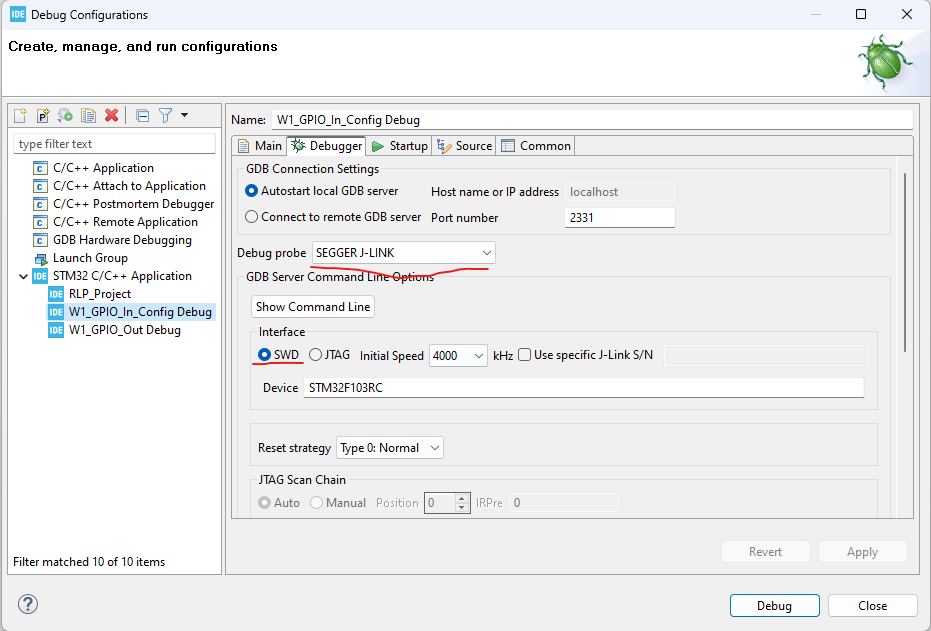
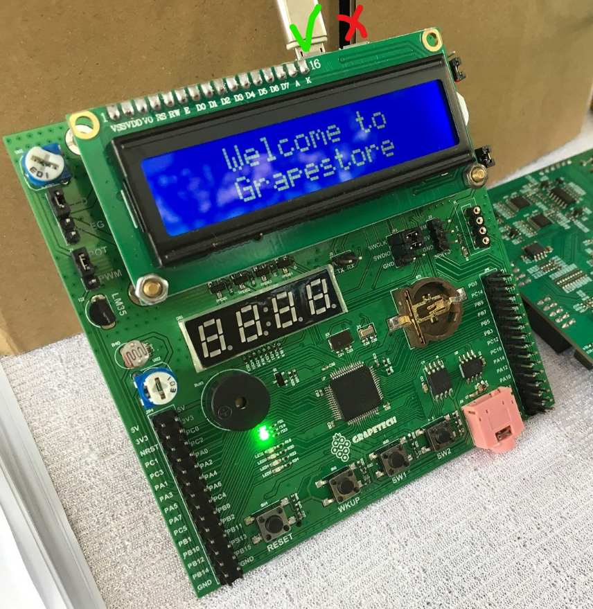

Debugging Sample Code
=====================

The following `Sample Code <section_sample_code_>`_ and `Debugger Configurations <sec_debugger_configs_>`_ is applied on the :ref:`sec-training-device` and the :ref:`Bare metal project <sec_bare_metal_project>`.

.. _section_sample_code:

Sample Code
-----------

.. code-block:: c

    // Src\main.c

    /**
    ******************************************************************************
    * @file           : main.c
    * @author         : Auto-generated by STM32CubeIDE
    * @brief          : Main program body
    ******************************************************************************
    * @attention
    *
    * Copyright (c) 2024 STMicroelectronics.
    * All rights reserved.
    *
    * This software is licensed under terms that can be found in the LICENSE file
    * in the root directory of this software component.
    * If no LICENSE file comes with this software, it is provided AS-IS.
    *
    ******************************************************************************
    */

    #include <stdint.h>
    #include <stm32f1xx.h>

    #if !defined(__SOFT_FP__) && defined(__ARM_FP)
    #warning "FPU is not initialized, but the project is compiling for an FPU. Please initialize the FPU before use."
    #endif

    void GPIO_init(void);
    void delay(int);

    int main(void) {
        GPIO_init();
        /* Loop forever */
        for (;;) {
            GPIOB->ODR |= (1 << 12);
            delay(1000);
            GPIOB->ODR &= ~(1 << 12);
            delay(1000);
        }
    }

    void GPIO_init(void) {
        //Enable Peripherals (GPIOB)
        RCC->APB2ENR |= (1 << 3); //Enables GPIOB peripheral (bit 3)

        //Set GPIOB, PIN 12 as Output (CRH[17:16] = 01)
        GPIOB->CRH &= ~(1 << 17);  // clear bit 17
        GPIOB->CRH |= (1 << 16); // set bit 16

        GPIOB->CRH &= ~(0b11 << 18); //Sets GPIOB, PIN 12 as push-pull

        GPIOB->ODR |= (1 << 12); //Initializes GPIOB, PIN 12 as HIGH
    }

    void delay(int d) {
        int i;
        for (; d > 0; d--) {
            for (i = 0; i < 2657; i++)
                ;
        }
    }

.. _sec_debugger_configs:

Debugger Configurations of the Training Board
---------------------------------------------

Cable Connection
----------------

