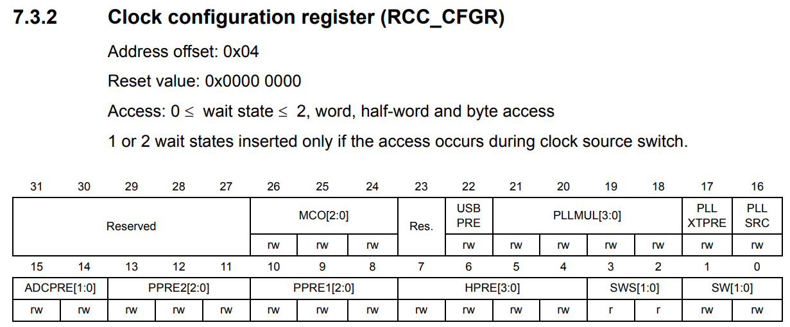

Analog-to-digital converter (ADC)
=================================


   LM35 Temperature Sensor. (Source: Grape32 Unleased Kit. Schematic \[[grape32_unleased_kit_sche]_\, page 7])

ADC Configuration:

   - Rank: 1
   - Channel: 3
   - Sample time: 239.5 cycles

ADC Conventional Configuration
------------------------------

Configure the ADC clock source
``````````````````````````````



   Clock configuration register (RCC_CFGR) (Source: \[[STM32_RM0008]_, page 134\])

.. code-block:: c

   /* Configure the ADC clock source */
   // Bits 15:14 ADCPRE: ADC prescaler
   RCC->CFGR |= (0b10 << 14); // PCLK2 divided by 6

Peripheral clock enable
```````````````````````

.. figure:: ../pics/W2_05-03-2024_19-52-47.png
   :align: center

   APB2 peripheral clock enable register (RCC_APB2ENR) (Source: \[[STM32_RM0008]_, page 112\])

.. code-block:: c

   /* Peripheral clock enable */
   // Bit 2 IOPAEN: I/O port A clock enable
   // Bit 9 ADC1EN: ADC 1 interface clock enable
   RCC->APB2ENR |= (1 << 2) | (1 << 9);

ADC1 GPIO Configuration
```````````````````````

.. code-block:: c

   /**ADC1 GPIO Configuration
         PA3     ------> ADC1_IN3
      */
   // Clear PA3 setup
   GPIOA->CRL &= ~(0xf << 12); // Input mode (reset state), Analog mode

Update ADC configuration register CR2
`````````````````````````````````````


   ADC control register 2 (ADC_CR2). (Source: \[[STM32_RM0008]_, page 240\])

.. code-block:: c

   /* Update ADC configuration register CR2 */
   // Bits 19:17 EXTSEL[2:0]: External event select for regular group
   ADC1->CR2 |= (0b111 << 17); // SWSTART

Regular sequence configuration
``````````````````````````````


   ADC regular sequence register 3 (ADC_SQR3). (Source: \[[STM32_RM0008]_, page 249\])

.. code-block:: c

   /* Regular sequence configuration */
   /* For Rank 1 to 6 */
   // Bits 4:0 SQ1[4:0]: first conversion in regular sequence
   ADC1->SQR3 |= (0b11 << 0); // Rank 1, channel 3

Channel sampling time configuration
```````````````````````````````````


   ADC sample time register 2 (ADC_SMPR2). (Source: \[[STM32_RM0008]_, page 245\])

.. code-block:: c

   /* Channel sampling time configuration */
   /* For channels 0 to 9 */
   // Bits 11:9 SMP3[2:0]: Channel 3 Sample time selection
   ADC1->SMPR2 |= (0b111 << 9); // 239.5 cycles

Enable the ADC Peripheral
`````````````````````````

.. code-block:: c

   /* Enable the Peripheral */
   // Bit 0 ADON: A/D converter ON / OFF
   ADC1->CR2 |= (1 << 0); // Enable ADC and to start conversion

Resets ADC calibration registers
````````````````````````````````

.. code-block:: c

   /* Resets ADC calibration registers */
   // Bit 3 RSTCAL: Reset calibration
   ADC1->CR2 |= (1 << 3); // Initialize calibration register.

Start ADC calibration
`````````````````````

.. code-block:: c

   /* Start ADC calibration */
   // Bit 2 CAL: A/D Calibration
   ADC1->CR2 |= (1 << 2); // Enable calibration

Check the End of conversion
```````````````````````````


   ADC status register (ADC_SR). (Source: \[[STM32_RM0008]_, page 237\])

.. code-block:: c

   // Bit 1 EOC: End of conversion
   while(!(ADC1->SR & (1 << 1)));

Get ADC Data and Calculate LM35 Temperature
```````````````````````````````````````````


   ADC regular data register (ADC_DR). (Source: \[[STM32_RM0008]_, page 251\])

.. code-block:: c

   uint32_t adcValue = ADC1->DR;
   float temp = (adcValue/4096.0)*3.3*100.0;

Full Implementation Source
``````````````````````````

GitHub Link: https://github.com/DESLab-Resources/STM32Training_Conv_ADC_T1

ADC Interrupt
-------------

ADC1 interrupt Init
```````````````````

.. code-block:: c

   /* ADC1 interrupt Init */
   NVIC_EnableIRQ(ADC1_2_IRQn);
   NVIC_SetPriority(ADC1_2_IRQn, 0);

Continuous conversion
`````````````````````

.. code-block:: c

   /* Update ADC configuration register CR2 */
   // Bit 1 CONT: Continuous conversion
   // Bits 19:17 EXTSEL[2:0]: External event select for regular group
   ADC1->CR2 |= (1 << 1) | (0b111 << 17);

Enable end of conversion interrupt for regular group
````````````````````````````````````````````````````

.. code-block:: c

   /* Enable end of conversion interrupt for regular group */
   // Bit 5 EOCIE: Interrupt enable for EOC
   ADC1->CR1 |= (1 << 5); // EOC interrupt enabled. An interrupt is generated when the EOC bit is set.

Start ADC conversion on regular group with SW start
```````````````````````````````````````````````````

.. code-block:: c

   /* Start ADC conversion on regular group with SW start */
   // Bit 20 EXTTRIG: External trigger conversion mode for regular channels
   // Bit 22 SWSTART: Start conversion of regular channels
   ADC1->CR2 |= (1 << 20) | (1 << 22);

Set up the **ADC1_2_IRQHandler**
````````````````````````````````

.. code-block:: c

   void ADC1_2_IRQHandler()
   {
      // ...
   }

Full Implementation Source
``````````````````````````

GitHub Link: https://github.com/DESLab-Resources/STM32Training_ADC_Interrupt.git

