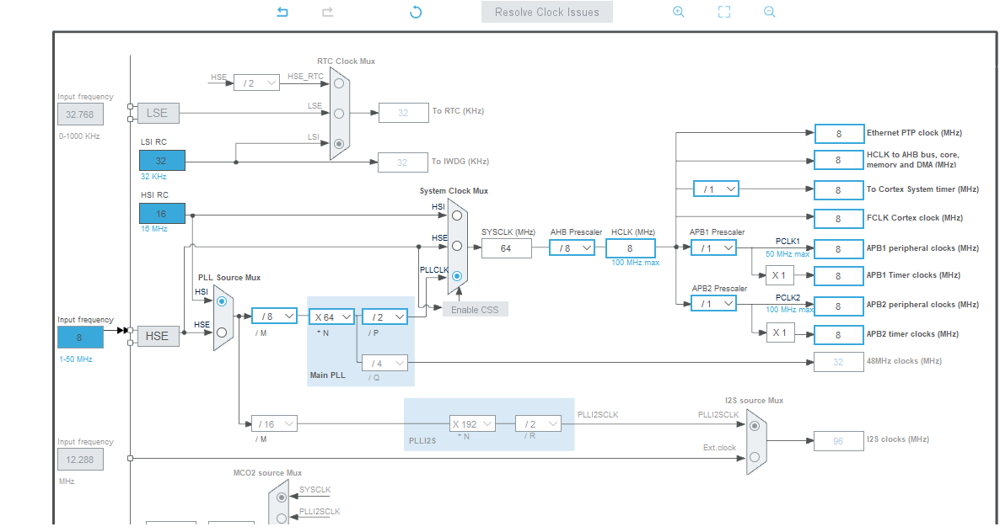
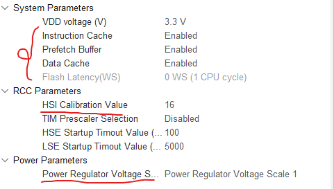
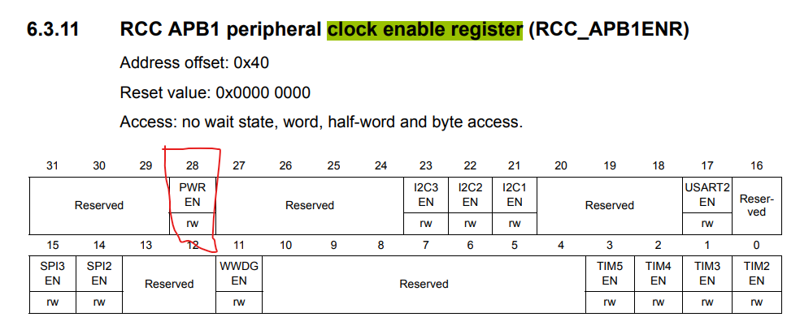
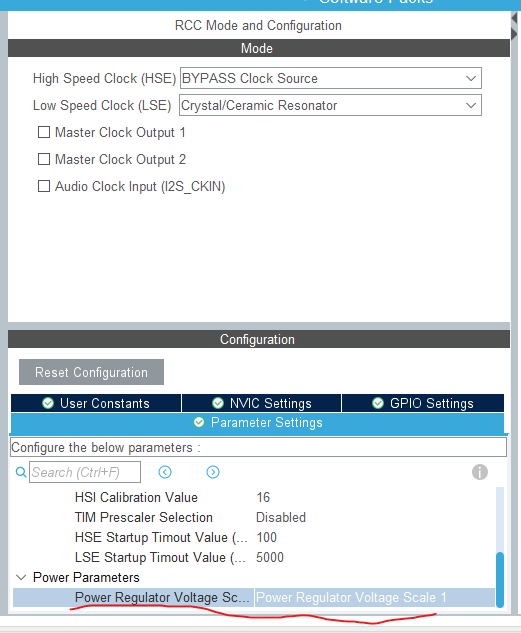
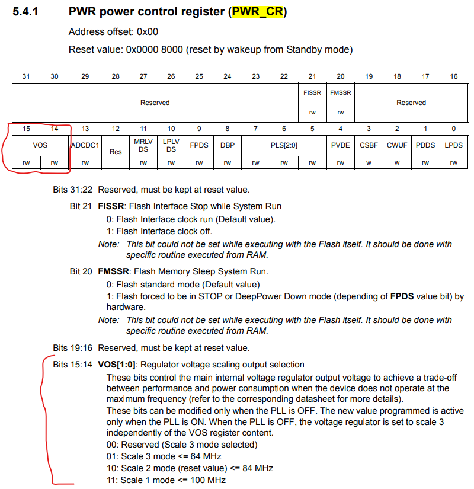
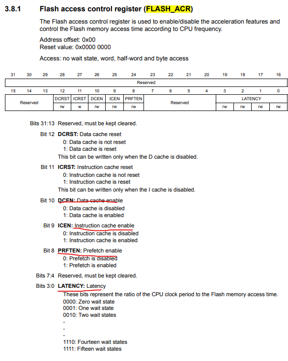
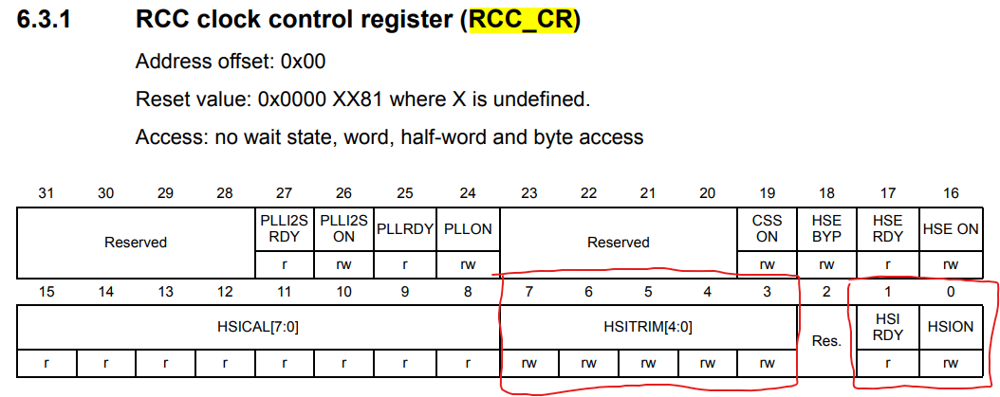
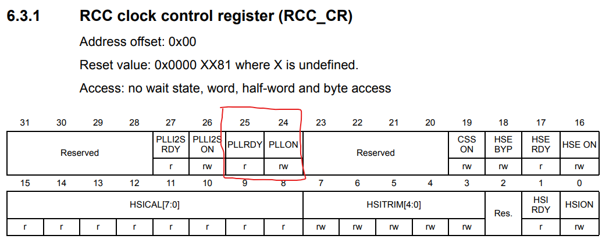
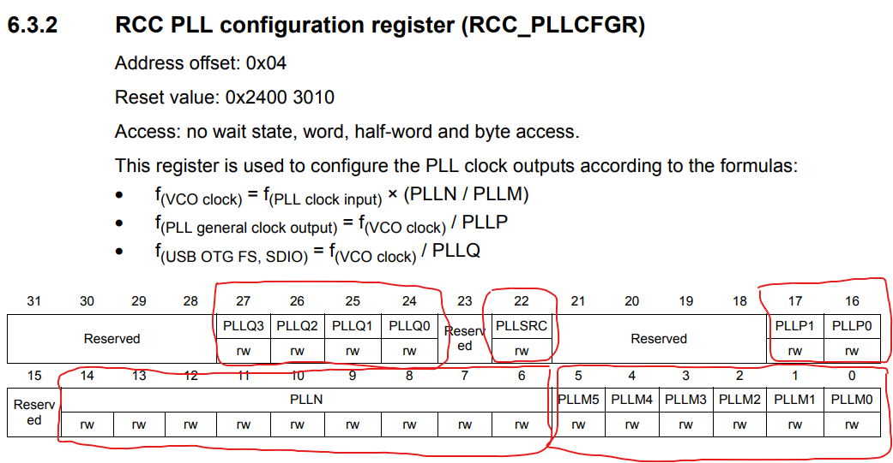
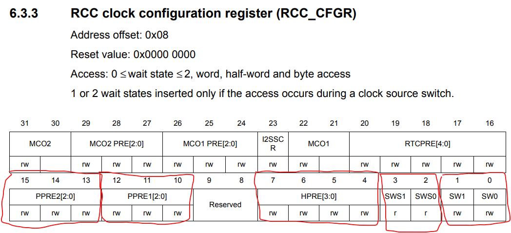

Clock Configuration
===================

Implementation Device: `Discovery kit with STM32F411VE MCU <https://www.st.com/en/evaluation-tools/32f411ediscovery.html>`_.

This clock configuration tutorial is based on Clock Configuration of STM32CubeMX Configuration GUI. On the configuration GUI, we follow the clock setting sample illustrated in :numref:`fig_Screenshot_2024-02-03_165901`. The configuration process follows the **SystemClock_Config** function (generated by STM32CubeMX Code Generator). Configuration steps are as follows:

    1. Configure the main internal regulator output voltage.
    2. Configure Flash prefetch, Instruction cache, Data cache.
    3. Initializes the RCC Oscillators.
    4. Initializes the CPU, AHB and APB buses clocks.

.. code-block:: c
    :linenos:

    void SystemClock_Config(void)
    {
    RCC_OscInitTypeDef RCC_OscInitStruct = {0};
    RCC_ClkInitTypeDef RCC_ClkInitStruct = {0};

    /** Configure the main internal regulator output voltage
    */
    __HAL_RCC_PWR_CLK_ENABLE();
    __HAL_PWR_VOLTAGESCALING_CONFIG(PWR_REGULATOR_VOLTAGE_SCALE1);

    /** Initializes the RCC Oscillators according to the specified parameters
    * in the RCC_OscInitTypeDef structure.
    */
    RCC_OscInitStruct.OscillatorType = RCC_OSCILLATORTYPE_HSI;
    RCC_OscInitStruct.HSIState = RCC_HSI_ON;
    RCC_OscInitStruct.HSICalibrationValue = RCC_HSICALIBRATION_DEFAULT;
    RCC_OscInitStruct.PLL.PLLState = RCC_PLL_ON;
    RCC_OscInitStruct.PLL.PLLSource = RCC_PLLSOURCE_HSI;
    RCC_OscInitStruct.PLL.PLLM = 8;
    RCC_OscInitStruct.PLL.PLLN = 64;
    RCC_OscInitStruct.PLL.PLLP = RCC_PLLP_DIV2;
    RCC_OscInitStruct.PLL.PLLQ = 4;
    if (HAL_RCC_OscConfig(&RCC_OscInitStruct) != HAL_OK)
    {
        Error_Handler();
    }

    /** Initializes the CPU, AHB and APB buses clocks
    */
    RCC_ClkInitStruct.ClockType = RCC_CLOCKTYPE_HCLK|RCC_CLOCKTYPE_SYSCLK
                                |RCC_CLOCKTYPE_PCLK1|RCC_CLOCKTYPE_PCLK2;
    RCC_ClkInitStruct.SYSCLKSource = RCC_SYSCLKSOURCE_PLLCLK;
    RCC_ClkInitStruct.AHBCLKDivider = RCC_SYSCLK_DIV8;
    RCC_ClkInitStruct.APB1CLKDivider = RCC_HCLK_DIV1;
    RCC_ClkInitStruct.APB2CLKDivider = RCC_HCLK_DIV1;

    if (HAL_RCC_ClockConfig(&RCC_ClkInitStruct, FLASH_LATENCY_0) != HAL_OK)
    {
        Error_Handler();
    }
    HAL_RCC_MCOConfig(RCC_MCO2, RCC_MCO2SOURCE_SYSCLK, RCC_MCODIV_1);
    }

.. _fig_Screenshot_2024-02-03_165901:


    Clock Configuration Sample on STM32CubeIDDE Configuration GUI.

.. _fig_Screenshot_2024-02-08_184624:


    Parameter Settings tab of STM32CubeMX.

1. Configure the main internal regulator output voltage
-------------------------------------------------------

Power interface clock enable
````````````````````````````

Based in the **RCC_APB1ENR** structure (illustrated in :numref:`RCC_APB1ENR_PWREN`), we can enable the power interface clock by set the 28th bit of the **RCC_APB1ENR** register.

.. _RCC_APB1ENR_PWREN:


    RCC APB1 peripheral clock enable register. (Source: \[[STM32_RM0383]_, page 118\])

.. code-block:: c

    // Power interface clock enable
    RCC->APB1ENR |= (1 << 28);

Regulator voltage scaling output selection
``````````````````````````````````````````

Based on the **Parameter Settings** tab of **RCC** section of STM32CubeMX (illustrated in :numref:`power_regulator_voltage_scale_1`), **Power Regulator Voltage Scale** is **Scale 1**.

.. _power_regulator_voltage_scale_1:


    Parameter Settings tab of STM32CubeMX.

According to the **PWR_CR** (illustrated in :numref:`PWR_CR_VOS`), we can enable the **Scale 1** mode by setting **0b11** value for the **Bits 15:14**.

.. _PWR_CR_VOS:


    PWR power control register. (Source: \[[STM32_RM0383]_, page 86\])

.. code-block:: c

    //  Regulator voltage scaling output selection
    PWR->CR |= (0b11 << 14); // Scale 1 mode <= 100 MHz

2. Configure Flash prefetch, Instruction cache, Data cache
----------------------------------------------------------

Based on the following **HAL_Init** function (in **stm32f4xx_hal.c**), we should enable the **Flash prefetch, Instruction cache, Data cache**. According to the 

.. code-block:: c
    :linenos:

    HAL_StatusTypeDef HAL_Init(void)
    {
        /* Configure Flash prefetch, Instruction cache, Data cache */
    #if (INSTRUCTION_CACHE_ENABLE != 0U)
        __HAL_FLASH_INSTRUCTION_CACHE_ENABLE();
    #endif /* INSTRUCTION_CACHE_ENABLE */

    #if (DATA_CACHE_ENABLE != 0U)
        __HAL_FLASH_DATA_CACHE_ENABLE();
    #endif /* DATA_CACHE_ENABLE */

    #if (PREFETCH_ENABLE != 0U)
        __HAL_FLASH_PREFETCH_BUFFER_ENABLE();
    #endif /* PREFETCH_ENABLE */

        /* Set Interrupt Group Priority */
        HAL_NVIC_SetPriorityGrouping(NVIC_PRIORITYGROUP_4);

        /* Use systick as time base source and configure 1ms tick (default clock after Reset is HSI) */
        HAL_InitTick(TICK_INT_PRIORITY);

        /* Init the low level hardware */
        HAL_MspInit();

        /* Return function status */
        return HAL_OK;
    }

According to the **FLASH_ACR** (illustrated in :numref:`FLASH_ACR_LATENCY`), we can set the **Bits 10:8** to respectively enable Prefetch, Data cache, and Instruction cache. Also based on this register, we can configure the **Flash Latency** is **0 WS** by resetting the **Bits 0:3** of the **FLASH_ACR**, following :numref:`fig_Screenshot_2024-02-08_184624`.

.. _FLASH_ACR_LATENCY:


    PWR power control register. (Source: \[[STM32_RM0383]_, page 59\])

.. code-block:: c

    FLASH->ACR |= (0b111 << 8); // Instruction cache, Data cache, Prefetch enable
    FLASH->ACR &= ~(0b1111 << 0); // Zero wait states

3. Initializes the RCC Oscillators
----------------------------------

HSI Configuration
`````````````````

Following the **HAL_RCC_OscConfig** function (in **stm32f4xx_hal_rcc.c**), we just have to adjust the HSI calibration value. However, to ensure the HSI enable, we can set the **0th bit** and check the **1th bit** of **RCC_CR** (illustrated in :numref:`Screenshot_2024-02-09_114407`).

.. code-block:: c

    __weak HAL_StatusTypeDef HAL_RCC_OscConfig(RCC_OscInitTypeDef  *RCC_OscInitStruct)
    {
        // ...
        /*----------------------------- HSI Configuration --------------------------*/
        if(((RCC_OscInitStruct->OscillatorType) & RCC_OSCILLATORTYPE_HSI) == RCC_OSCILLATORTYPE_HSI)
        {
            /* Check the parameters */
            assert_param(IS_RCC_HSI(RCC_OscInitStruct->HSIState));
            assert_param(IS_RCC_CALIBRATION_VALUE(RCC_OscInitStruct->HSICalibrationValue));

            /* Check if HSI is used as system clock or as PLL source when PLL is selected as system clock */
            if((__HAL_RCC_GET_SYSCLK_SOURCE() == RCC_CFGR_SWS_HSI) ||\
            ((__HAL_RCC_GET_SYSCLK_SOURCE() == RCC_CFGR_SWS_PLL) && ((RCC->PLLCFGR & RCC_PLLCFGR_PLLSRC) == RCC_PLLCFGR_PLLSRC_HSI)))
            {
            /* When HSI is used as system clock it will not disabled */
            if((__HAL_RCC_GET_FLAG(RCC_FLAG_HSIRDY) != RESET) && (RCC_OscInitStruct->HSIState != RCC_HSI_ON))
            {
                return HAL_ERROR;
            }
            /* Otherwise, just the calibration is allowed */
            else
            {
                /* Adjusts the Internal High Speed oscillator (HSI) calibration value.*/
                __HAL_RCC_HSI_CALIBRATIONVALUE_ADJUST(RCC_OscInitStruct->HSICalibrationValue);
            }
            }
        // ...
    }

Following :numref:`fig_Screenshot_2024-02-08_184624`, we adjust **16** to the **HSITRIM**, based on **HSI Calibration Value** in :numref:`fig_Screenshot_2024-02-08_184624`.

.. _Screenshot_2024-02-09_114407:


    RCC clock control register

.. code-block:: c

    // Internal high-speed clock enable
    RCC->CR |= (1 << 0); // HSI oscillator ON

    // Internal high-speed clock ready flag
    while(!(RCC->CR & (1 << 1))); // wait until HSI enable

    // Internal high-speed clock trimming
    RCC->CR &= ~(0b11111 << 3); // clear 5 bits of HSITRIM
    RCC->CR |= (0b10000 << 3); // HSITRIM is 16

PLL Configuration
`````````````````

According to :numref:`cb_PLL_Config`, the PLL Configuration is as follows:

    1. Disable the main PLL and wait till PLL is disabled.
    2. Configure the main PLL clock source, multiplication and division factors.
    3. Enable the main PLL and wait till PLL is ready.

.. ._cb_PLL_Config:
.. code-block:: c
    :caption: PLL Configuration in **HAL_RCC_OscConfig** function of **stm32f4xx_hal_rcc.c**.
    :name: cb_PLL_Config

    /*-------------------------------- PLL Configuration -----------------------*/
    /* Check the parameters */
    assert_param(IS_RCC_PLL(RCC_OscInitStruct->PLL.PLLState));
    if ((RCC_OscInitStruct->PLL.PLLState) != RCC_PLL_NONE)
    {
    /* Check if the PLL is used as system clock or not */
    if(__HAL_RCC_GET_SYSCLK_SOURCE() != RCC_CFGR_SWS_PLL)
    {
        if((RCC_OscInitStruct->PLL.PLLState) == RCC_PLL_ON)
        {
        /* Check the parameters */
        assert_param(IS_RCC_PLLSOURCE(RCC_OscInitStruct->PLL.PLLSource));
        assert_param(IS_RCC_PLLM_VALUE(RCC_OscInitStruct->PLL.PLLM));
        assert_param(IS_RCC_PLLN_VALUE(RCC_OscInitStruct->PLL.PLLN));
        assert_param(IS_RCC_PLLP_VALUE(RCC_OscInitStruct->PLL.PLLP));
        assert_param(IS_RCC_PLLQ_VALUE(RCC_OscInitStruct->PLL.PLLQ));

        /* Disable the main PLL. */
        __HAL_RCC_PLL_DISABLE();

        /* Get Start Tick */
        tickstart = HAL_GetTick();

        /* Wait till PLL is disabled */
        while(__HAL_RCC_GET_FLAG(RCC_FLAG_PLLRDY) != RESET)
        {
            if((HAL_GetTick() - tickstart ) > PLL_TIMEOUT_VALUE)
            {
            return HAL_TIMEOUT;
            }
        }

        /* Configure the main PLL clock source, multiplication and division factors. */
        WRITE_REG(RCC->PLLCFGR, (RCC_OscInitStruct->PLL.PLLSource                                            | \
                                    RCC_OscInitStruct->PLL.PLLM                                                 | \
                                    (RCC_OscInitStruct->PLL.PLLN << RCC_PLLCFGR_PLLN_Pos)             | \
                                    (((RCC_OscInitStruct->PLL.PLLP >> 1U) - 1U) << RCC_PLLCFGR_PLLP_Pos) | \
                                    (RCC_OscInitStruct->PLL.PLLQ << RCC_PLLCFGR_PLLQ_Pos)));
        /* Enable the main PLL. */
        __HAL_RCC_PLL_ENABLE();

        /* Get Start Tick */
        tickstart = HAL_GetTick();

        /* Wait till PLL is ready */
        while(__HAL_RCC_GET_FLAG(RCC_FLAG_PLLRDY) == RESET)
        {
            if((HAL_GetTick() - tickstart ) > PLL_TIMEOUT_VALUE)
            {
            return HAL_TIMEOUT;
            }
        }
        }

Disable the main PLL and wait till PLL is disabled
''''''''''''''''''''''''''''''''''''''''''''''''''

Based on the **RCC_CR** (illustrated in :numref:`fig_RCC_CR_PLL_ON_RDY`), we can reset the **24th bit** to disable PLL and use the **25th bit** to check current PLL enable status.

.. _fig_RCC_CR_PLL_ON_RDY:


    RCC clock control register.

.. code-block:: c

    // Main PLL (PLL) enable
    RCC->CR &= ~(1 << 24);// PLL OFF
    // Main PLL (PLL) clock ready flag
    while(RCC->CR & (1 << 25)); // wait until PLL off

Configure the main PLL clock source, multiplication and division factors.
''''''''''''''''''''''''''''''''''''''''''''''''''''''''''''''''''''''''''''''''

According the setting of :numref:`fig_Screenshot_2024-02-03_165901`, we configure these following parameters:

    1. PLL source: HSI.
    2. PLLM = 8.
    3. PLLN = 64.
    4. PLLP = 2.
    5. PLLQ = 4.

Corresponding to the **RCC_PLLCFGR** (illustrated in :numref:`Screenshot_2024-02-09_150552`), we set value for these following bits:

    1. Bit 22 = 0.
    2. Bits 5:0 = 8.
    3. Bits 14:6 = 64.
    4. Bits 17:16 = 2.
    5. Bits 27:24 = 4.



    RCC PLL configuration register

.. code-block:: c

    // Main PLL(PLL) and audio PLL (PLLI2S) entry clock source
    RCC->PLLCFGR &= ~(1 << 22);// HSI clock selected as PLL and PLLI2S clock entry

    // Division factor for the main PLL (PLL) input clock
    RCC->PLLCFGR &= ~(0x3f << 0); // clear 6 bit of PLLM
    RCC->PLLCFGR |= (8 << 0); //  PLLM=8

    // Main PLL (PLL) multiplication factor for VCO
    RCC->PLLCFGR &= ~(0x1ff << 6); // clear 9 bit of PLLN
    RCC->PLLCFGR |= (64 << 6); //  PLLN=64

    // Main PLL (PLL) division factor for main system clock
    RCC->PLLCFGR &= ~(0x3 << 16); // clear 2 bit of PLLP
    RCC->PLLCFGR |= (2 << 16); //  PLLP=2

    // Main PLL (PLL) division factor for USB OTG FS, and SDIO clocks
    RCC->PLLCFGR &= ~(0xf << 24); // clear 4 bit of PLLQ
    RCC->PLLCFGR |= (4 << 24); //  PLLQ=4

Enable the main PLL and wait till PLL is ready.
'''''''''''''''''''''''''''''''''''''''''''''''

Similar to disabling the PLL, instead, we just reset the **24th bit** to enable PLL and use the **25th bit** to check current PLL enable status.

.. code-block:: c

    // Main PLL (PLL) enable
    RCC->CR |= (1 << 24);// PLL ON
    // Main PLL (PLL) clock ready flag
    while(!(RCC->CR & (1 << 25))); // wait until PLL ready

4. Initializes the CPU, AHB and APB buses clocks
------------------------------------------------



    RCC clock configuration register

HCLK Configuration
``````````````````

Based on the :numref:`code-block_HCLK_config`, we can setup **HCLK Configuration** by the following steps:

    1. Set the highest **APBx dividers**.
    2. Configure the **AHB Clock Divider**.

.. code-block:: c
    :caption: HCLK Configuration in **HAL_RCC_OscConfig** function of **stm32f4xx_hal_rcc.c**.
    :name: code-block_HCLK_config

    HAL_StatusTypeDef HAL_RCC_ClockConfig(RCC_ClkInitTypeDef  *RCC_ClkInitStruct, uint32_t FLatency)
    {
    //...

        /*-------------------------- HCLK Configuration --------------------------*/
        if(((RCC_ClkInitStruct->ClockType) & RCC_CLOCKTYPE_HCLK) == RCC_CLOCKTYPE_HCLK)
        {
        /* Set the highest APBx dividers in order to ensure that we do not go through
            a non-spec phase whatever we decrease or increase HCLK. */
        if(((RCC_ClkInitStruct->ClockType) & RCC_CLOCKTYPE_PCLK1) == RCC_CLOCKTYPE_PCLK1)
        {
            MODIFY_REG(RCC->CFGR, RCC_CFGR_PPRE1, RCC_HCLK_DIV16);
        }

        if(((RCC_ClkInitStruct->ClockType) & RCC_CLOCKTYPE_PCLK2) == RCC_CLOCKTYPE_PCLK2)
        {
            MODIFY_REG(RCC->CFGR, RCC_CFGR_PPRE2, (RCC_HCLK_DIV16 << 3));
        }

        assert_param(IS_RCC_HCLK(RCC_ClkInitStruct->AHBCLKDivider));
        MODIFY_REG(RCC->CFGR, RCC_CFGR_HPRE, RCC_ClkInitStruct->AHBCLKDivider);
        }

    // ...
    }

According the setting of :numref:`fig_Screenshot_2024-02-03_165901`, we configure these following parameters:

    1. AHB prescaler: system clock divided by 8
    2. APB1 and APB2 prescaler: AHB clock divided by 16

Corresponding to the **RCC_CFGR** (illustrated in :numref:`fig_RCC_CFGR_HPRE_SW_PPRE`), we respectively set value for these following bits:

    1. Bits 15:10 = 0x3f.
    2. Bits 7:4 = 0b1010.

.. code-block:: c

    // HCLK Configuration
    /* Set the highest APBx dividers in order to ensure that we do not go through
            a non-spec phase whatever we decrease or increase HCLK. */
    RCC->CFGR |= (0x3f << 10); // set bit 10 -> 15

    // HPRE: AHB prescaler
    //	RCC->CFGR &= ~(0b1111 << 4);// system clock not divided: system clock divided by 1
    RCC->CFGR &= ~(0b1111 << 4); // clear 4 bit of AHB prescaler
    RCC->CFGR |= (0b1010 << 4);// system clock divided by 8

SYSCLK Configuration
````````````````````

According to :numref:`code-block_SYSCLK_config`, we must set appropiate value for **System clock switch**.

Corresponding to the setting of :numref:`fig_Screenshot_2024-02-03_165901`, we select **PLL** as the **System clock**.

.. code-block:: c
    :caption: SYSCLK Configuration in **HAL_RCC_OscConfig** function of **stm32f4xx_hal_rcc.c**.
    :name: code-block_SYSCLK_config

    HAL_StatusTypeDef HAL_RCC_ClockConfig(RCC_ClkInitTypeDef  *RCC_ClkInitStruct, uint32_t FLatency)
    {
    //...

        __HAL_RCC_SYSCLK_CONFIG(RCC_ClkInitStruct->SYSCLKSource);

    // ...
    }

Following the **RCC_CFGR** (illustrated in :numref:`fig_RCC_CFGR_HPRE_SW_PPRE`), we adjust **0b10** to **Bits 1:0** and check **System clock switch status** based on the **Bits 3:2**.

.. code-block:: c

    // System clock switch
    RCC->CFGR &= ~(0b11 << 0); // clear 2 bit of SW
    RCC->CFGR |= (0b10 << 0); // PLL selected as system clock

    // System clock switch status
    while((RCC->CFGR & (0b11 << 1)) != 0b10); // wait until PLL is used as the system clock

APBx Configuration
``````````````````

According to :numref:`code-block_SYSCLK_config`, we must set appropiate value for **APBx prescaler**.

Corresponding to the setting of :numref:`fig_Screenshot_2024-02-03_165901`, we configure these following parameters:

    1. APB Low speed prescaler (**APB1**): AHB clock not divided.
    2. APB high-speed prescaler (**APB2**): AHB clock not divided.

.. code-block:: c
    :caption: APBx Configuration in **HAL_RCC_OscConfig** function of **stm32f4xx_hal_rcc.c**.
    :name: code-block_APBx_config

    HAL_StatusTypeDef HAL_RCC_ClockConfig(RCC_ClkInitTypeDef  *RCC_ClkInitStruct, uint32_t FLatency)
    {
    //...

        /*-------------------------- PCLK1 Configuration ---------------------------*/
        if(((RCC_ClkInitStruct->ClockType) & RCC_CLOCKTYPE_PCLK1) == RCC_CLOCKTYPE_PCLK1)
        {
        assert_param(IS_RCC_PCLK(RCC_ClkInitStruct->APB1CLKDivider));
        MODIFY_REG(RCC->CFGR, RCC_CFGR_PPRE1, RCC_ClkInitStruct->APB1CLKDivider);
        }

        /*-------------------------- PCLK2 Configuration ---------------------------*/
        if(((RCC_ClkInitStruct->ClockType) & RCC_CLOCKTYPE_PCLK2) == RCC_CLOCKTYPE_PCLK2)
        {
        assert_param(IS_RCC_PCLK(RCC_ClkInitStruct->APB2CLKDivider));
        MODIFY_REG(RCC->CFGR, RCC_CFGR_PPRE2, ((RCC_ClkInitStruct->APB2CLKDivider) << 3U));
        }

    // ...
    }

According to the **RCC_CFGR** (illustrated in :numref:`fig_RCC_CFGR_HPRE_SW_PPRE`), we respectively set value for these following bits:

    1. Bits 12:10 = 0b000.
    2. Bits 15:13 = 0b000.

.. code-block:: c

    // PCLK1 Configuration: APB Low speed prescaler (APB1)
    RCC->CFGR &= ~(0b111 << 10); // AHB clock divided by 1

    // PCLK2 Configuration: APB high-speed prescaler (APB2)
    RCC->CFGR &= ~(0b111 << 13); // AHB clock divided by 1

Full Implementation Source
--------------------------

.. code-block:: c

    #include <stdint.h>
    #include <stm32f4xx.h>

    int main(void)
    {
        // Power interface clock enable
        RCC->APB1ENR |= (1 << 28);

        //  Regulator voltage scaling output selection
        PWR->CR |= (0b11 << 14); // Scale 1 mode <= 100 MHz

        //
        FLASH->ACR |= (0b111 << 8); // Instruction cache, Data cache, Prefetch enable
        FLASH->ACR &= ~(0b1111 << 0); // Zero wait states


        //
        // Internal high-speed clock enable
        RCC->CR |= (1 << 0); // HSI oscillator ON

        // Internal high-speed clock ready flag
        while(!(RCC->CR & (1 << 1))); // wait until HSI enable

        // Internal high-speed clock trimming
        RCC->CR &= ~(0b11111 << 3); // clear 5 bits of HSITRIM
        RCC->CR |= (0b10000 << 3); // HSITRIM is 16


        //
        // Off PLL for configuration
        // Main PLL (PLL) enable
        RCC->CR &= ~(1 << 24);// PLL OFF
        // Main PLL (PLL) clock ready flag
        while(RCC->CR & (1 << 25)); // wait until PLL off

        // Main PLL(PLL) and audio PLL (PLLI2S) entry clock source
        RCC->PLLCFGR &= ~(1 << 22);// HSI clock selected as PLL and PLLI2S clock entry

        // Division factor for the main PLL (PLL) input clock
        RCC->PLLCFGR &= ~(0x3f << 0); // clear 6 bit of PLLM
        RCC->PLLCFGR |= (8 << 0); //  PLLM=8

        // Main PLL (PLL) multiplication factor for VCO
        RCC->PLLCFGR &= ~(0x1ff << 6); // clear 9 bit of PLLN
        RCC->PLLCFGR |= (64 << 6); //  PLLN=64

        // Main PLL (PLL) division factor for main system clock
        RCC->PLLCFGR &= ~(0x3 << 16); // clear 2 bit of PLLP
        RCC->PLLCFGR |= (2 << 16); //  PLLP=2

        // Main PLL (PLL) division factor for USB OTG FS, and SDIO clocks
        RCC->PLLCFGR &= ~(0xf << 24); // clear 4 bit of PLLQ
        RCC->PLLCFGR |= (4 << 24); //  PLLQ=4

        //
        // On PLL after configuration complete
        // Main PLL (PLL) enable
        RCC->CR |= (1 << 24);// PLL ON
        // Main PLL (PLL) clock ready flag
        while(!(RCC->CR & (1 << 25))); // wait until PLL ready

        //
        // HCLK Configuration
        //PPRE1: APB Low speed prescaler (APB1)

        /* Set the highest APBx dividers in order to ensure that we do not go through
                a non-spec phase whatever we decrease or increase HCLK. */
        RCC->CFGR |= (0x3f << 10); // set bit 10 -> 15

        // HPRE: AHB prescaler
        //	RCC->CFGR &= ~(0b1111 << 4);// system clock not divided: system clock divided by 1
        RCC->CFGR &= ~(0b1111 << 4); // clear 4 bit of AHB prescaler
        RCC->CFGR |= (0b1010 << 4);// system clock divided by 8

        //
        // System clock switch
        RCC->CFGR &= ~(0b11 << 0); // clear 2 bit of SW
        RCC->CFGR |= (0b10 << 0); // PLL selected as system clock

        // System clock switch status
        while((RCC->CFGR & (0b11 << 1)) != 0b10); // wait until PLL is used as the system clock

        //
        // PCLK1 Configuration: APB Low speed prescaler (APB1)
        RCC->CFGR &= ~(0b111 << 10); // AHB clock divided by 1

        // PCLK2 Configuration: APB high-speed prescaler (APB2)
        RCC->CFGR &= ~(0b111 << 13); // AHB clock divided by 1
        /* Loop forever */
        for(;;);
    }

Reference
---------

`STM32 Clock Setup using Registers » ControllersTech <https://controllerstech.com/stm32-clock-setup-using-registers/>`_

.. [STM32_RM0383] https://www.st.com/resource/en/reference_manual/rm0383-stm32f411xce-advanced-armbased-32bit-mcus-stmicroelectronics.pdf
