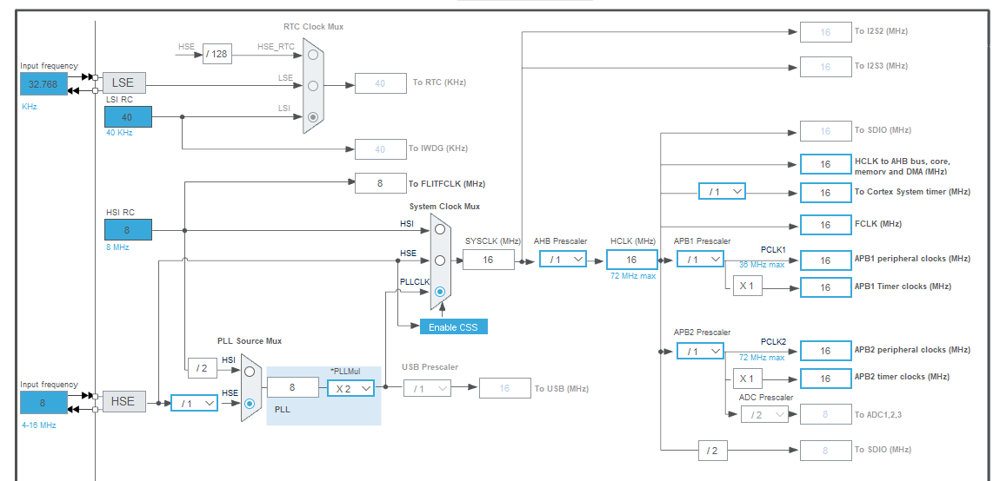
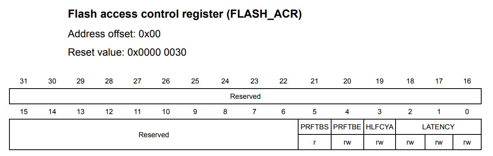
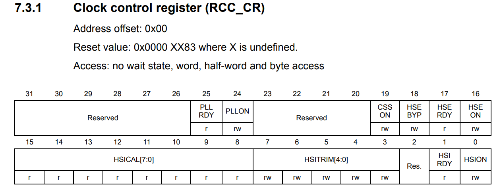
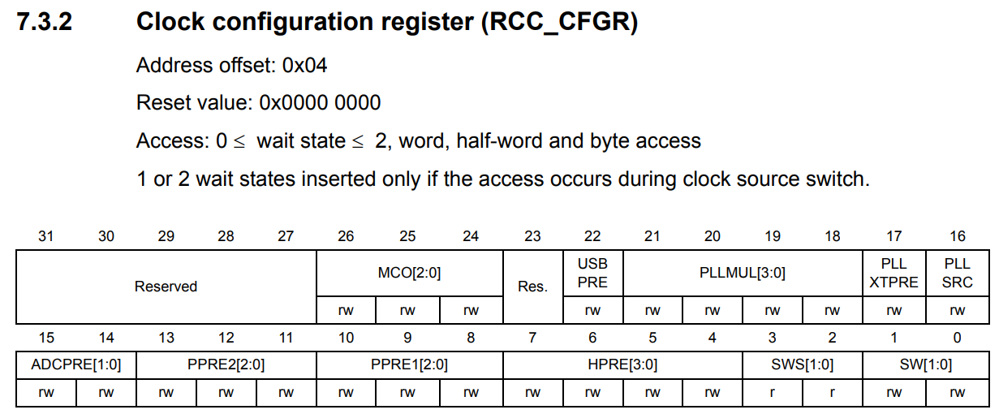

Clock Configuration For STM32F1
===============================

Device: `Grape32 Unleashed Kit <https://store.grapetech.vn/product/bo-mach-vdk-grape32-unleashed-kit/>`_

This CLock Configuration Training is based on the HAL approach configuration, as follows:

   1. Enable Prefetch buffer
   2. Initializes the RCC Oscillators

      - HSE Configuration
      - PLL Configuration
   3. Initializes the CPU, AHB and APB buses clocks

      - HCLK Configuration
      - SYSCLK Configuration
      - PCLK1 Configuration
      - PCLK2 Configuration

Configuration Target
--------------------

We will configure the clock based on :numref:`fig_W1_23-02-2024_9-59-55`. This settings will config an 16MHz frequency to the **SYSCLK**. The clock configuration programming follows the **SystemClock_Config** Function (illustrated in :numref:`cb_w1_sys_clk_cfg_func`) with mentioned steps above.



   Clock Configuration Target.

.. code-block:: c
   :linenos:
   :name: cb_w1_sys_clk_cfg_func
   :caption: System Clock Configuration Function in **Core/Src/main.c**

   /**
   * @brief System Clock Configuration
   * @retval None
   */
   void SystemClock_Config(void)
   {
   RCC_OscInitTypeDef RCC_OscInitStruct = {0};
   RCC_ClkInitTypeDef RCC_ClkInitStruct = {0};

   /** Initializes the RCC Oscillators according to the specified parameters
   * in the RCC_OscInitTypeDef structure.
   */
   RCC_OscInitStruct.OscillatorType = RCC_OSCILLATORTYPE_HSE;
   RCC_OscInitStruct.HSEState = RCC_HSE_ON;
   RCC_OscInitStruct.HSEPredivValue = RCC_HSE_PREDIV_DIV1;
   RCC_OscInitStruct.HSIState = RCC_HSI_ON;
   RCC_OscInitStruct.PLL.PLLState = RCC_PLL_ON;
   RCC_OscInitStruct.PLL.PLLSource = RCC_PLLSOURCE_HSE;
   RCC_OscInitStruct.PLL.PLLMUL = RCC_PLL_MUL2;
   if (HAL_RCC_OscConfig(&RCC_OscInitStruct) != HAL_OK)
   {
      Error_Handler();
   }

   /** Initializes the CPU, AHB and APB buses clocks
   */
   RCC_ClkInitStruct.ClockType = RCC_CLOCKTYPE_HCLK|RCC_CLOCKTYPE_SYSCLK
                                 |RCC_CLOCKTYPE_PCLK1|RCC_CLOCKTYPE_PCLK2;
   RCC_ClkInitStruct.SYSCLKSource = RCC_SYSCLKSOURCE_PLLCLK;
   RCC_ClkInitStruct.AHBCLKDivider = RCC_SYSCLK_DIV1;
   RCC_ClkInitStruct.APB1CLKDivider = RCC_HCLK_DIV1;
   RCC_ClkInitStruct.APB2CLKDivider = RCC_HCLK_DIV1;

   if (HAL_RCC_ClockConfig(&RCC_ClkInitStruct, FLASH_LATENCY_0) != HAL_OK)
   {
      Error_Handler();
   }
   }

1. Enable Prefetch buffer
-------------------------

Base on the *HAL_Init* function, we setup the FLASH's Prefetch buffer by setting the 4th bit of the **FLASH_ACR**.

.. code-block:: c
   :linenos:

   HAL_StatusTypeDef HAL_Init(void)
   {
      /* Configure Flash prefetch */
      #if (PREFETCH_ENABLE != 0)
      #if defined(STM32F101x6) || defined(STM32F101xB) || defined(STM32F101xE) || defined(STM32F101xG) || \
         defined(STM32F102x6) || defined(STM32F102xB) || \
         defined(STM32F103x6) || defined(STM32F103xB) || defined(STM32F103xE) || defined(STM32F103xG) || \
         defined(STM32F105xC) || defined(STM32F107xC)

         /* Prefetch buffer is not available on value line devices */
         __HAL_FLASH_PREFETCH_BUFFER_ENABLE();
      // ...
   }



.. code-block:: c

   // Bit 4 PRFTBE: Prefetch buffer enable
   FLASH->ACR |= (1 << 4); // Prefetch is enabled

2. Initializes the RCC Oscillators
----------------------------------

HSE Configuration
`````````````````

Based on the **HAL_RCC_OscConfig**'s **HSE Configuration** section, we enable the **HSE** by setting the 16th bit of the **RCC_CR**. We check the enable status of the **HSE** by reading the 17th bit.

.. code-block:: c

   HAL_StatusTypeDef HAL_RCC_OscConfig(RCC_OscInitTypeDef  *RCC_OscInitStruct)
   {
     // ...
     /*------------------------------- HSE Configuration ------------------------*/
         if((__HAL_RCC_GET_SYSCLK_SOURCE() ==RCC_SYSCLKSOURCE_STATUS_HSE)
             || ((__HAL_RCC_GET_SYSCLK_SOURCE() ==RCC_SYSCLKSOURCE_STATUS_PLLCLK) && (__HAL_RCC_GET_PLL_OSCSOURCE() ==RCC_PLLSOURCE_HSE)))
        // ...
         else
            {
                /* Set the new HSE configuration ---------------------------------------*/
                __HAL_RCC_HSE_CONFIG(RCC_OscInitStruct->HSEState);
                /* Check the HSE State */
                if(RCC_OscInitStruct->HSEState !=RCC_HSE_OFF)
                {
                    /* Get Start Tick */
                    tickstart =HAL_GetTick();

                    /* Wait till HSE is ready */
                    while(__HAL_RCC_GET_FLAG(RCC_FLAG_HSERDY) ==RESET)
                    {
                        if((HAL_GetTick() -tickstart) >HSE_TIMEOUT_VALUE)
                        {
                            returnHAL_TIMEOUT;
                        }
                    }
                }
                // ...
        }
    // ...
   }



   Clock control register (RCC_CR) (Source: \[[STM32_RM0008]_, page 99\])

.. code-block:: c
   :linenos:

   //
   // HSE Configuration
   // Bit 16 HSEON: HSE clock enable
   RCC->CR |= (1 << 16); // HSE oscillator ON

   /* Wait till HSE is ready */
   // Bit 17 HSERDY: External high-speed clock ready flag
   while(!(RCC->CR & (1 << 17)));

PLL Configuration
`````````````````

Based on the **HAL_RCC_OscConfig**'s **PLL Configuration** section, we configure the **PLL** clock following these steps:

   1. Disable the **PLL** by resetting the **24th** bit of the **RCC_CR** (illustrated in :numref:`fig_W1_23-02-2024_10-26-49`).We check the enable status of the **PLL** by reading the **25th** bit.
   2. Select HSE oscillator clock as PLL input clock by setting value **0b1** to the **16th** bit of the **RCC_CFGR**.
   3. Configure PLL input clock x 2 by setting value **0b0000** to bits 21:18 of the **RCC_CFGR**.
   4. Enable the **PLL**.

.. code-block:: c
   :linenos:

   HAL_StatusTypeDef HAL_RCC_OscConfig(RCC_OscInitTypeDef  *RCC_OscInitStruct)
   {
   // ...
      /*-------------------------------- PLL Configuration -----------------------*/
      if((RCC_OscInitStruct->PLL.PLLState) !=RCC_PLL_NONE)
      {
            /* Check if the PLL is used as system clock or not */
         if(__HAL_RCC_GET_SYSCLK_SOURCE() !=RCC_SYSCLKSOURCE_STATUS_PLLCLK)
            {
               if((RCC_OscInitStruct->PLL.PLLState) ==RCC_PLL_ON)
               {
                  /* Disable the main PLL. */
                  __HAL_RCC_PLL_DISABLE();
                  /* Get Start Tick */
                  tickstart =HAL_GetTick();

                  /* Wait till PLL is disabled */
                  while(__HAL_RCC_GET_FLAG(RCC_FLAG_PLLRDY)  !=RESET)
                  {
                     if((HAL_GetTick() -tickstart) >PLL_TIMEOUT_VALUE)
                     {
                           returnHAL_TIMEOUT;
                     }
                  }
                  /* Configure the HSE prediv factor --------------------------------*/
                  /* It can be written only when the PLL is disabled. Not used in PLL source is different than HSE */
                  if(RCC_OscInitStruct->PLL.PLLSource ==RCC_PLLSOURCE_HSE)
                  {
                     /* Check the parameter */
                     assert_param(IS_RCC_HSE_PREDIV(RCC_OscInitStruct->HSEPredivValue));
                  #if defined(RCC_CFGR2_PREDIV1SRC)
                     assert_param(IS_RCC_PREDIV1_SOURCE(RCC_OscInitStruct->Prediv1Source));

                     /* Set PREDIV1 source */
                     SET_BIT(RCC->CFGR2,RCC_OscInitStruct->Prediv1Source);
                  #endif/* RCC_CFGR2_PREDIV1SRC */

                     /* Set PREDIV1 Value */
                     __HAL_RCC_HSE_PREDIV_CONFIG(RCC_OscInitStruct->HSEPredivValue);
                  }
                  /* Configure the main PLL clock source and multiplication factors. */
                  __HAL_RCC_PLL_CONFIG(RCC_OscInitStruct->PLL.PLLSource,
                                                            RCC_OscInitStruct->PLL.PLLMUL);
                  /* Enable the main PLL. */
                  __HAL_RCC_PLL_ENABLE();

                  /* Get Start Tick */
                  tickstart =HAL_GetTick();

                  /* Wait till PLL is ready */
                  while(__HAL_RCC_GET_FLAG(RCC_FLAG_PLLRDY)  ==RESET)
                  {
                     if((HAL_GetTick() -tickstart) >PLL_TIMEOUT_VALUE)
                     {
                           returnHAL_TIMEOUT;
                     }
                  }

               }
         }
      }
   // ...
   }



   Clock configuration register (RCC_CFGR) (Source: \[[STM32_RM0008]_, page 134\])

.. code-block:: c
   :linenos:

   //
   // PLL Configuration
   /* Disable the main PLL. */
   // Bit 24 PLLON: PLL enable
   RCC->CR &= ~(1 << 24); // PLL OFF

   /* Wait till PLL is disabled */
   // Bit 25 PLLRDY: PLL clock ready flag
   while(RCC->CR & (1 << 25));

   /* Set PREDIV1 Value */
   // Bit 17 PLLXTPRE: HSE divider for PLL entry
   RCC->CFGR &= ~(1 << 17); // HSE clock not divided

   /* Configure the main PLL clock source and multiplication factors. */
   // Bit 16 PLLSRC: PLL entry clock source
   RCC->CFGR |= (1 << 16); // HSE oscillator clock selected as PLL input clock
   // Bits 21:18 PLLMUL: PLL multiplication factor
   RCC->CFGR &= ~(0b1111 << 18); // PLL input clock x 2

   /* Enable the main PLL. */
   // Bit 24 PLLON: PLL enable
   RCC->CR |= (1 << 24); // PLL ON

   /* Wait till PLL is ready */
   // Bit 25 PLLRDY: PLL clock ready flag
   while(!(RCC->CR & (1 << 25)));

1. Initializes the CPU, AHB and APB buses clocks
------------------------------------------------

HCLK Configuration
``````````````````

Base on the **HAL_RCC_ClockConfig** function's **HCLK Configuration** section, we setup the **HCLK Configuration** as follows:

   1. Set the highest APBx dividers in order to ensure that we do not go through a non-spec phase whatever we decrease or increase HCLK.
   2. Set the new HCLK clock divider.

.. code-block:: c
   :linenos:

   HAL_StatusTypeDef HAL_RCC_ClockConfig(RCC_ClkInitTypeDef  *RCC_ClkInitStruct, uint32_t FLatency)
   {
   // ...
      /*-------------------------- HCLK Configuration --------------------------*/
      if(((RCC_ClkInitStruct->ClockType) &RCC_CLOCKTYPE_HCLK) ==RCC_CLOCKTYPE_HCLK)
         {
            /* Set the highest APBx dividers in order to ensure that we do not go through
         a non-spec phase whatever we decrease or increase HCLK. */
            if(((RCC_ClkInitStruct->ClockType) &RCC_CLOCKTYPE_PCLK1) ==RCC_CLOCKTYPE_PCLK1)
            {
                MODIFY_REG(RCC->CFGR,RCC_CFGR_PPRE1,RCC_HCLK_DIV16);
            }

            if(((RCC_ClkInitStruct->ClockType) &RCC_CLOCKTYPE_PCLK2) ==RCC_CLOCKTYPE_PCLK2)
            {
                MODIFY_REG(RCC->CFGR,RCC_CFGR_PPRE2, (RCC_HCLK_DIV16 <<3));
            }
            /* Set the new HCLK clock divider */
            assert_param(IS_RCC_HCLK(RCC_ClkInitStruct->AHBCLKDivider));
            MODIFY_REG(RCC->CFGR,RCC_CFGR_HPRE,RCC_ClkInitStruct->AHBCLKDivider);
        }
   // ...
   }

.. code-block:: c
   :linenos:

   // HCLK Configuration
   /* Set the highest APBx dividers in order to ensure that we do not go through
         5     a non-spec phase whatever we decrease or increase HCLK. */
   // Bits 10:8 PPRE1: APB low-speed prescaler (APB1)
   RCC->CFGR |= (0b111 << 8); // HCLK divided by 16
   // Bits 13:11 PPRE2: APB high-speed prescaler (APB2)
   RCC->CFGR |= (0b111 << 11); // HCLK divided by 16

   /* Set the new HCLK clock divider */
   // Bits 7:4 HPRE: AHB prescaler
   RCC->CFGR &= ~(0b1111 << 4); // SYSCLK not divided

SYSCLK Configuration
````````````````````

Base on the **HAL_RCC_ClockConfig** function's **SYSCLK Configuration** section, we setup the **SYSCLK Configuration** as follows:

   1. Select PLL as System Clock Source.
   2. Check the PLL ready flag.
   3. Config the **SYSCLK** clock source.
   4. Check the current **SYSCLK** clock source.

.. code-block:: c
   :linenos:

   HAL_StatusTypeDef HAL_RCC_ClockConfig(RCC_ClkInitTypeDef  *RCC_ClkInitStruct, uint32_t FLatency)
   {
   // ...
         /*------------------------- SYSCLK Configuration ---------------------------*/
         if(((RCC_ClkInitStruct->ClockType) &RCC_CLOCKTYPE_SYSCLK) ==RCC_CLOCKTYPE_SYSCLK)
         {
            /* HSE is selected as System Clock Source */
            if(RCC_ClkInitStruct->SYSCLKSource ==RCC_SYSCLKSOURCE_HSE)
            // ...
                     /* PLL is selected as System Clock Source */
            else if(RCC_ClkInitStruct->SYSCLKSource ==RCC_SYSCLKSOURCE_PLLCLK)
            {
                  /* Check the PLL ready flag */
                  if(__HAL_RCC_GET_FLAG(RCC_FLAG_PLLRDY) ==RESET)
                  {
                     returnHAL_ERROR;
                  }
            }
            // ...
            __HAL_RCC_SYSCLK_CONFIG(RCC_ClkInitStruct->SYSCLKSource);
            /* Get Start Tick */
            tickstart =HAL_GetTick();
      
            while(__HAL_RCC_GET_SYSCLK_SOURCE() != (RCC_ClkInitStruct->SYSCLKSource <<RCC_CFGR_SWS_Pos))
            {
                  if((HAL_GetTick() -tickstart) >CLOCKSWITCH_TIMEOUT_VALUE)
                  {
                     returnHAL_TIMEOUT;
                  }
            }
         }
   // ...
   }

.. code-block:: c
   :linenos:

   //
   // SYSCLK Configuration
   /* PLL is selected as System Clock Source */
   // Bit 25 PLLRDY: PLL clock ready flag
   /* Check the PLL ready flag */
   while(!(RCC->CR & (1 << 25)));

   // Bits 1:0 SW: System clock switch
   RCC->CFGR &= ~(1 << 0); // PLL selected as system clock
   RCC->CFGR |= (1 << 1);

   while( ( ( RCC->CFGR & (0b11 << 2) ) >> 2 ) != (0b10) ); // Bits 3:2 SWS: System clock switch status

PCLK1 and PCLK2 Configuration
`````````````````````````````

Base on the **HAL_RCC_ClockConfig** function's **PCLKx Configuration** sections, we setup the **PCLKx Configuration** as follows:

   1. Configure that HCLK not divided for PBCLK1.
   2. Configure that HCLK not divided for PBCLK2.

.. code-block:: c
   :linenos:

   HAL_StatusTypeDef HAL_RCC_ClockConfig(RCC_ClkInitTypeDef  *RCC_ClkInitStruct, uint32_t FLatency)
   {
   // ...
      /*-------------------------- PCLK1 Configuration ---------------------------*/
      if(((RCC_ClkInitStruct->ClockType) &RCC_CLOCKTYPE_PCLK1) ==RCC_CLOCKTYPE_PCLK1)
      {
         assert_param(IS_RCC_PCLK(RCC_ClkInitStruct->APB1CLKDivider));
         MODIFY_REG(RCC->CFGR,RCC_CFGR_PPRE1,RCC_ClkInitStruct->APB1CLKDivider);
      }
      /*-------------------------- PCLK2 Configuration ---------------------------*/
      if(((RCC_ClkInitStruct->ClockType) &RCC_CLOCKTYPE_PCLK2) ==RCC_CLOCKTYPE_PCLK2)
      {
         assert_param(IS_RCC_PCLK(RCC_ClkInitStruct->APB2CLKDivider));
         MODIFY_REG(RCC->CFGR,RCC_CFGR_PPRE2, ((RCC_ClkInitStruct->APB2CLKDivider) <<3));
      }
   // ...
   }

.. code-block:: c
   :linenos:

   //
   // PCLK1 Configuration
   // Bits 10:8 PPRE1: APB low-speed prescaler (APB1)
   RCC->CFGR &= ~(0b111 << 8); // HCLK not divided

   // PCLK2 Configuration
   // Bits 13:11 PPRE2: APB high-speed prescaler (APB2)
   RCC->CFGR &= ~(0b111 << 11); // HCLK not divided

Full Implementation Source
--------------------------

.. code-block:: c

   #include <stdint.h>
   #include "stm32f1xx.h"
   #if !defined(__SOFT_FP__) && defined(__ARM_FP)
   #warning "FPU is not initialized, but the project is compiling for an FPU. Please initialize the FPU before use."
   #endif

   int main(void)
   {
      // Bit 4 PRFTBE: Prefetch buffer enable
      FLASH->ACR |= (1 << 4); // Prefetch is enabled

      /** Initializes the RCC Oscillators according to the specified parameters
         * in the RCC_OscInitTypeDef structure.
         */
      //
      // HSE Configuration
      // Bit 16 HSEON: HSE clock enable
      RCC->CR |= (1 << 16); // HSE oscillator ON

      /* Wait till HSE is ready */
      // Bit 17 HSERDY: External high-speed clock ready flag
      while(!(RCC->CR & (1 << 17)));

      //
      // PLL Configuration
      /* Disable the main PLL. */
      // Bit 24 PLLON: PLL enable
      RCC->CR &= ~(1 << 24); // PLL OFF

      /* Wait till PLL is disabled */
      // Bit 25 PLLRDY: PLL clock ready flag
      while(RCC->CR & (1 << 25));

      /* Set PREDIV1 Value */
      // Bit 17 PLLXTPRE: HSE divider for PLL entry
      RCC->CFGR &= ~(1 << 17); // HSE clock not divided

      /* Configure the main PLL clock source and multiplication factors. */
      // Bit 16 PLLSRC: PLL entry clock source
      RCC->CFGR |= (1 << 16); // HSE oscillator clock selected as PLL input clock
      // Bits 21:18 PLLMUL: PLL multiplication factor
      RCC->CFGR &= ~(0b1111 << 18); // PLL input clock x 2

      /* Enable the main PLL. */
      // Bit 24 PLLON: PLL enable
      RCC->CR |= (1 << 24); // PLL ON

      /* Wait till PLL is ready */
      // Bit 25 PLLRDY: PLL clock ready flag
      while(!(RCC->CR & (1 << 25)));

      //
      // Bits 2:0 LATENCY: Latency
      FLASH->ACR &= ~(0b111 << 0); // Zero wait state, if 0 < SYSCLK <= 24 MHz

      /** Initializes the CPU, AHB and APB buses clocks
         */
      //
      // HCLK Configuration
      /* Set the highest APBx dividers in order to ensure that we do not go through
            5     a non-spec phase whatever we decrease or increase HCLK. */
      // Bits 10:8 PPRE1: APB low-speed prescaler (APB1)
      RCC->CFGR |= (0b111 << 8); // HCLK divided by 16
      // Bits 13:11 PPRE2: APB high-speed prescaler (APB2)
      RCC->CFGR |= (0b111 << 11); // HCLK divided by 16

      /* Set the new HCLK clock divider */
      // Bits 7:4 HPRE: AHB prescaler
      RCC->CFGR &= ~(0b1111 << 4); // SYSCLK not divided

      //
      // SYSCLK Configuration
      /* PLL is selected as System Clock Source */
      // Bit 25 PLLRDY: PLL clock ready flag
      /* Check the PLL ready flag */
      while(!(RCC->CR & (1 << 25)));

      // Bits 1:0 SW: System clock switch
      RCC->CFGR &= ~(1 << 0); // PLL selected as system clock
      RCC->CFGR |= (1 << 1);

      while( ( ( RCC->CFGR & (0b11 << 2) ) >> 2 ) != (0b10) ); // Bits 3:2 SWS: System clock switch status

      //
      // PCLK1 Configuration
      // Bits 10:8 PPRE1: APB low-speed prescaler (APB1)
      RCC->CFGR &= ~(0b111 << 8); // HCLK not divided

      // PCLK2 Configuration
      // Bits 13:11 PPRE2: APB high-speed prescaler (APB2)
      RCC->CFGR &= ~(0b111 << 11); // HCLK not divided

      /* Loop forever */
      for(;;);
   }


Reference
---------

1. `STM32 Clock Setup using Registers >> ControllersTech <https://controllerstech.com/stm32-clock-setup-using-registers/>`_

.. .[STM32_RM0008] https://www.st.com/resource/en/reference_manual/rm0008-stm32f101xx-stm32f102xx-stm32f103xx-stm32f105xx-and-stm32f107xx-advanced-armbased-32bit-mcus-stmicroelectronics.pdf
