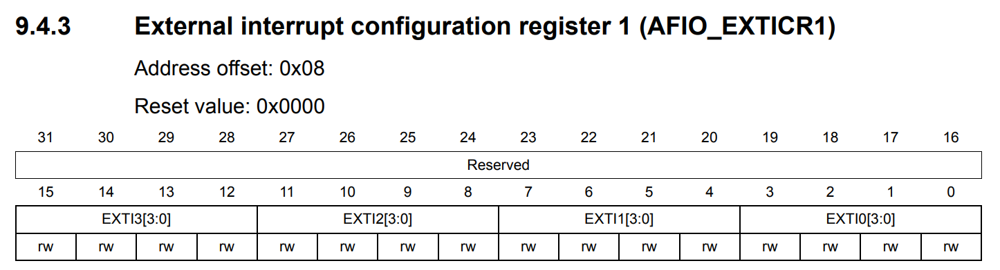

External Interrupt (EXTI)
=========================

This training material demonstrates how to use **EXTI** to capture the **Button-1**-pushing event.

**PB1** is in low state when **SW2** is pushed.

.. _fig_grape_tech_btn1:
.. figure:: ../pics/grape_tech_btn1.png
    :align: center

    Button 1 Schematic of the Training Board. (Source: Grape32 Unleased Kit Schematic \[[grape32_unleased_kit_sche]_\, page 7])

1. Enable AFIO Clock
--------------------

.. figure:: ../pics/W2_05-03-2024_19-52-47.png
   :align: center

   APB2 peripheral clock enable register (RCC_APB2ENR) (Source: \[[STM32_RM0008]_, page 112\])

.. code-block:: c

   // Bit 0:0 AFIOEN: Alternate function IO clock enable
   RCC->APB2ENR |= (1 << 0); // 1: Alternate Function IO clock enabled

2. Select PB1 input for EXTT1
-----------------------------

   External interrupt configuration register 1 (AFIO_EXTICR1) (Source: \[[STM32_RM0008]_, page 191\])

.. code-block:: c

   // Bits 7:4 EXTI1[3:0]: EXTI 1
   AFIO->EXTICR[0] &= 	~(0xF << 4);
   AFIO->EXTICR[0] |= 	(1 << 4); // 0001: PB1 pin

3. Unmask interrupt request from Line 1
---------------------------------------

   Interrupt mask register (EXTI_IMR) (Source: \[[STM32_RM0008]_, page 211\])

.. code-block:: c

   // Bits 1:1 MRx: Interrupt Mask on line 1
   EXTI->IMR |= (1 << 1); // Interrupt request from Line 1 is not masked

4. Disable rising trigger
-------------------------

   Rising trigger selection register (EXTI_RTSR) (Source: \[[STM32_RM0008]_, page 212\])

.. code-block:: c

   //
   // Bits 1:1 TRx: Rising trigger event configuration bit of line 1
   EXTI->RTSR &= ~(1 << 1); // Rising trigger disabled (for Event and Interrupt) for input line

5. Enable falling trigger
-------------------------

   Falling trigger selection register (EXTI_FTSR) (Source: \[[STM32_RM0008]_, page 212\])

.. code-block:: c

   // Bits 1:1 TRx: Falling trigger event configuration bit of line 1
   EXTI->FTSR |= (1 << 1); // Falling trigger enabled (for Event and Interrupt) for input line.

6. Init EXTI interrupt
----------------------

.. code-block:: c

   //
   NVIC_SetPriority(EXTI1_IRQn, 1);
   NVIC_EnableIRQ(EXTI1_IRQn);

.. .. code-block:: c
..    :linenos:

..    HAL_StatusTypeDef HAL_Init(void)
..    {
..    /* Configure Flash prefetch */
..    #if (PREFETCH_ENABLE != 0)
..    #if defined(STM32F101x6) || defined(STM32F101xB) || defined(STM32F101xE) || defined(STM32F101xG) || \
..       defined(STM32F102x6) || defined(STM32F102xB) || \
..       defined(STM32F103x6) || defined(STM32F103xB) || defined(STM32F103xE) || defined(STM32F103xG) || \
..       defined(STM32F105xC) || defined(STM32F107xC)

..    /* Prefetch buffer is not available on value line devices */
..    __HAL_FLASH_PREFETCH_BUFFER_ENABLE();
..    #endif
..    #endif /* PREFETCH_ENABLE */

..    /* Set Interrupt Group Priority */
..    HAL_NVIC_SetPriorityGrouping(NVIC_PRIORITYGROUP_4);

..    /* Use systick as time base source and configure 1ms tick (default clock after Reset is HSI) */
..    HAL_InitTick(TICK_INT_PRIORITY);

..    /* Init the low level hardware */
..    HAL_MspInit();

..    /* Return function status */
..    return HAL_OK;
..    }

.. .. code-block:: c
..    :linenos:

..    static void MX_GPIO_Init(void)
..    {
..    GPIO_InitTypeDef GPIO_InitStruct = {0};
..    /* USER CODE BEGIN MX_GPIO_Init_1 */
..    /* USER CODE END MX_GPIO_Init_1 */

..    /* GPIO Ports Clock Enable */
..    __HAL_RCC_GPIOC_CLK_ENABLE();
..    __HAL_RCC_GPIOD_CLK_ENABLE();
..    __HAL_RCC_GPIOB_CLK_ENABLE();
..    __HAL_RCC_GPIOA_CLK_ENABLE();

..    /*Configure GPIO pin Output Level */
..    HAL_GPIO_WritePin(GPIOB, GPIO_PIN_12, GPIO_PIN_RESET);

..    /*Configure GPIO pin : PB1 */
..    GPIO_InitStruct.Pin = GPIO_PIN_1;
..    GPIO_InitStruct.Mode = GPIO_MODE_IT_FALLING;
..    GPIO_InitStruct.Pull = GPIO_NOPULL;
..    HAL_GPIO_Init(GPIOB, &GPIO_InitStruct);

..    /*Configure GPIO pin : PB12 */
..    GPIO_InitStruct.Pin = GPIO_PIN_12;
..    GPIO_InitStruct.Mode = GPIO_MODE_OUTPUT_PP;
..    GPIO_InitStruct.Pull = GPIO_NOPULL;
..    GPIO_InitStruct.Speed = GPIO_SPEED_FREQ_LOW;
..    HAL_GPIO_Init(GPIOB, &GPIO_InitStruct);

..    /* EXTI interrupt init*/
..    HAL_NVIC_SetPriority(EXTI1_IRQn, 0, 0);
..    HAL_NVIC_EnableIRQ(EXTI1_IRQn);

..    /* USER CODE BEGIN MX_GPIO_Init_2 */
..    /* USER CODE END MX_GPIO_Init_2 */
..    }

.. .. code-block:: c
..    :linenos:

..    __STATIC_INLINE void __NVIC_SetPriority(IRQn_Type IRQn, uint32_t priority)
..    {
..       if ((int32_t)(IRQn) >= 0)
..       {
..          NVIC->IP[((uint32_t)IRQn)]               = (uint8_t)((priority << (8U - __NVIC_PRIO_BITS)) & (uint32_t)0xFFUL);
..       }
..       else
..       {
..          SCB->SHP[(((uint32_t)IRQn) & 0xFUL)-4UL] = (uint8_t)((priority << (8U - __NVIC_PRIO_BITS)) & (uint32_t)0xFFUL);
..       }
..    }

Demo Code: Toggle LED0 when Button 1 is pushed
----------------------------------------------

.. code-block:: c
   :linenos:
   :emphasize-lines: 7,15,36-58,73-82

   #include <stdint.h>
   #include "stm32f1xx.h"
   #if !defined(__SOFT_FP__) && defined(__ARM_FP)
   #warning "FPU is not initialized, but the project is compiling for an FPU. Please initialize the FPU before use."
   #endif

   void Interrupt_Config (void);
   void GPIO_Config (void);

   uint8_t flag_EXTI1 = 0;
   int main(void)
   {
      SystemInit();

      Interrupt_Config ();
      GPIO_Config();

      /* Loop forever */
      for(;;)
      {
         if (flag_EXTI1)
         {
            flag_EXTI1 = 0;

            // From HAL_GPIO_TogglePin
            uint16_t LED_PIN = (1 << 12);
            uint32_t LED0_mask = (GPIOB->ODR & LED_PIN);
            uint16_t LED_set_mask = ~LED0_mask & LED_PIN;
            uint16_t LED_reset_mask = LED0_mask & LED_PIN;

            GPIOB->BSRR |= (LED_set_mask | (LED_reset_mask << 16));
         }
      }
   }

   void Interrupt_Config (void)
   {
      // Bit 0:0 AFIOEN: Alternate function IO clock enable
      RCC->APB2ENR |= (1 << 0); // 1: Alternate Function IO clock enabled

      // Bits 7:4 EXTI1[3:0]: EXTI 1
      AFIO->EXTICR[0] &= 	~(0xF << 4);
      AFIO->EXTICR[0] |= 	(1 << 4); // 0001: PB1 pin

      // Bits 1:1 MRx: Interrupt Mask on line 1
      EXTI->IMR |= (1 << 1); // Interrupt request from Line 1 is not masked

      //
      // Bits 1:1 TRx: Rising trigger event configuration bit of line 1
      EXTI->RTSR &= ~(1 << 1); // Rising trigger disabled (for Event and Interrupt) for input line

      // Bits 1:1 TRx: Falling trigger event configuration bit of line 1
      EXTI->FTSR |= (1 << 1); // Falling trigger enabled (for Event and Interrupt) for input line.

      //
      NVIC_SetPriority(EXTI1_IRQn, 1);
      NVIC_EnableIRQ(EXTI1_IRQn);
   }

   void GPIO_Config (void)
   {
      // Set IOPB EN
      RCC->APB2ENR |= (1 << 3); // Enable GPIOB clock

      // Set MODE12[1:0] = 01: : Output mode, max speed 10 MHz
      GPIOB->CRH |= (1 << 16); // set bit 16
      GPIOB->CRH &= ~(1 << 17); // clear bit 17

      // Clear  CNF12[1:0]: General purpose output push-pull
      GPIOB->CRH &= ~(0b11 << 18);
   }

   void EXTI1_IRQHandler(void)
   {

      // PRx: Pending bit
      if(EXTI->PR & (1 << 1)) // 1: selected trigger request occurred
      {
         flag_EXTI1 = 1;
         EXTI->PR |= (1 << 1); // "This bit is cleared by writing a ‘1’ into the bit. "
      }
   }

EXTI1_IRQHandler initialization
-------------------------------

**EXTI1_IRQHandler** is initialized in the file **startup_stm32f103rctx.s**.

.. code-block:: asm
   :linenos:
   :caption: /Startup/startup_stm32f103rctx.s

   // ...

   g_pfnVectors:
      .word	EXTI1_IRQHandler          			/* EXTI Line1 interrupt                             */

      // ...

      .weak	EXTI1_IRQHandler
      .thumb_set EXTI1_IRQHandler,Default_Handler

Reference
---------

   `External Interrupt using Registers » ControllersTech <https://controllerstech.com/external-interrupt-using-registers/>`_
