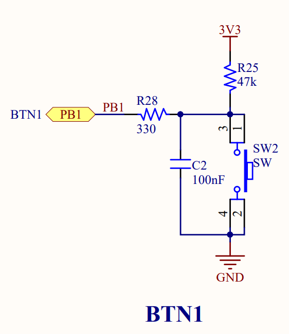

GPIO Configurations
===================

OUTPUT Configurations
---------------------

In this section, we configure output mode for the *LED0* in the training board. According to the :numref:`grape_tech_led`, *LED0* is connected to *PB12*. Therefore, on programming, we setup output configuration for the PB12

.. _grape_tech_led:


    Compansional LED Schematic of the Grape32 Unleased Kit. (Source: Grape32 Unleased Kit Schematic \[[grape32_unleased_kit_sche]_\, page 7])

1. Enable the GPIOB Clock
`````````````````````````

To enable Port B operation of the training :term:`MCU`, we first enable the GPIOB clock by setting the third bit of the RCC_APB2 register (following instruction of :numref:`RCC_APB2_IOPB_EN`).

.. _RCC_APB2_IOPB_EN:


    APB2 peripheral clock enable register. (Source: \[[STM32_RM0008]_, page 146\])

.. code-block:: diff

    // Src\main.c

    #include <stdint.h>
    #include <stm32f1xx.h>
    // ...

    int main(void)
    {
    +    // Set IOPB EN
    +    RCC->APB2ENR |= (1 << 3); // Enable GPIOB clock

        /* Loop forever */
        for(;;)
        {
            // ...
        }
    }

2. Configure Output Mode
````````````````````````

After enable the GPIOB clock, we continue to configure the output mode. Based on the **GPIOx_CRH** (illustrated in :numref:`fig_GPIOx_CRH`), we setup the bit group of **MODE12\[1:0\]** and **CNF12\[1:0\]**, corresponding to the **PB12**. We setup the **MODE12[1:0]** is **01** (output mode, max speed 10 MHz), and the **CNF12\[1:0\]** is **00** (general purpose output push-pull).

.. _fig_GPIOx_CRH:


    Port configuration register high register. (Source: \[[STM32_RM0008]_, page 172\])

.. code-block:: diff

    // Src\main.c

    // ...

    int main(void)
    {
        // Set IOPB EN
        RCC->APB2ENR |= (1 << 3); // Enable GPIOB clock

    +    // Set MODE12[1:0] = 01: : Output mode, max speed 10 MHz
    +    GPIOB->CRH |= (1 << 16); // set bit 16
    +    GPIOB->CRH &= ~(1 << 17); // clear bit 17

    +    // Clear  CNF12[1:0]: General purpose output push-pull
    +    GPIOB->CRH &= ~(0b11 << 18);

        /* Loop forever */
        for(;;)
        {
            // ...
        }
    }

Option 1: Using Port bit set/reset register (GPIOx_BSRR)
````````````````````````````````````````````````````````

According to the **GPIOx_BSRR** structure (illustrated in :numref:`fig_GPIOx_BSRR`), we can set/reset value of **PB12** by set the 12th or 28th bit.

.. _fig_GPIOx_BSRR:


    Port bit set/reset register. (Source: \[[STM32_RM0008]_, page 173\])

.. code-block:: c

    // Opt 1: BSSR
    // Set GPIOB Pin 12
    GPIOB->BSRR |= (1 << 12);

    // Reset GPIOB Pin 12
    GPIOB->BSRR |= (1 << 28);

Option 2: Using Port output data register (GPIOx_ODR)
`````````````````````````````````````````````````````

According to the **GPIOx_ODR** structure (illustrated in :numref:`fig_GPIOx_ODR`), we can set/reset value of **PB12** by set/reset the 12th bit.

.. _fig_GPIOx_ODR:


    Port output data register. (Source: \[[STM32_RM0008]_, page 173\])

.. code-block:: c

    // Opt 2: ODR
    // Set GPIOB Pin 12
    GPIOB->ODR |= (1 << 12);

    // Reset GPIOB Pin 12
    GPIOB->ODR &= ~(1 << 12);

Demo code: Blinking the *LED0* of the training board using GPIOx_BSRR register
``````````````````````````````````````````````````````````````````````````````

.. code-block:: diff

    #include <stdint.h>
    #include <stm32f1xx.h>
    + void Delay (uint32_t time);

    int main(void)
    {
        // Set IOPB EN
        RCC->APB2ENR |= (1 << 3); // Enable GPIOB clock

        // Set MODE12[1:0] = 01: : Output mode, max speed 10 MHz
        GPIOB->CRH |= (1 << 16); // set bit 16
        GPIOB->CRH &= ~(1 << 17); // clear bit 17

        // Clear  CNF12[1:0]: General purpose output push-pull
        GPIOB->CRH &= ~(0b11 << 18);

        /* Loop forever */
        for(;;)
        {
    +        // Opt 1: BSSR
    +        // Set GPIOB Pin 12
    +        GPIOB->BSRR |= (1 << 12);
    +        Delay (10000000);  // random delay
    +        // Reset GPIOB Pin 12
    +        GPIOB->BSRR |= (1 << 28);
    +        Delay (10000000);  // random delay
        }

    }

    + void Delay (uint32_t time)
    + {
    +     while (time--);
    + }

Demo code: Blinking the *LED0* of the training board using GPIOx_ODR register
`````````````````````````````````````````````````````````````````````````````

.. code-block:: diff

    #include <stdint.h>
    #include <stm32f1xx.h>
    + void Delay (uint32_t time);

    int main(void)
    {
        // Set IOPB EN
        RCC->APB2ENR |= (1 << 3); // Enable GPIOB clock

        // Set MODE12[1:0] = 01: : Output mode, max speed 10 MHz
        GPIOB->CRH |= (1 << 16); // set bit 16
        GPIOB->CRH &= ~(1 << 17); // clear bit 17

        // Clear  CNF12[1:0]: General purpose output push-pull
        GPIOB->CRH &= ~(0b11 << 18);

        /* Loop forever */
        for(;;)
        {
    +	     // Opt 2: ODR
    +        // Set GPIOB Pin 12
    +        GPIOB->ODR |= (1 << 12);
    +        Delay (10000000);  // random delay

    +        // Reset GPIOB Pin 12
    +        GPIOB->ODR &= ~(1 << 12);
    +        Delay (10000000);  // random delay
        }

    }

    + void Delay (uint32_t time)
    + {
    +     while (time--);
    + }

INPUT Configurations
--------------------

In the training board, we will config the **input mode** for the **Button 1**. According to the schematic of the Button 1 (illustrated in :numref:`fig_grape_tech_btn1`), the state of Button 1 is connected to **PB1** of the training board. Hence, we configure **input mode** for the **PB1** to read the Button 1's state.

.. _fig_grape_tech_btn1:


    Button 1 Schematic of the Training Board. (Source: Grape32 Unleased Kit Schematic \[[grape32_unleased_kit_sche]_\, page 7])

1. Enable the GPIOB Clock
`````````````````````````

To enable Port B operation of the training :term:`MCU`, we first enable the GPIOB clock by setting the third bit of the RCC_APB2 register (following instruction of :numref:`RCC_APB2_IOPB_EN`).

.. code-block:: diff

    // Src\main.c

    #include <stdint.h>
    #include <stm32f1xx.h>
    // ...

    int main(void)
    {
    +    // Set IOPB EN
    +    RCC->APB2ENR |= (1 << 3); // Enable GPIOB clock

        /* Loop forever */
        for(;;)
        {
            // ...
        }
    }

2. Configure Input Mode
```````````````````````

After enable the GPIOB clock, we continue to configure the input mode. Based on the **GPIOx_CRL** (illustrated in :numref:`fig_GPIOx_CRL_pin1`), we setup the bit group of **MODE1\[1:0\]** and **CNF1\[1:0\]**, corresponding to the **PB1**. We setup the **MODE1[1:0]** is **00** (input mode), and the **CNF1\[1:0\]** is **01** (floating input).

.. _fig_GPIOx_CRL_pin1:


    Port configuration register low. (Source: \[[STM32_RM0008]_, page 171\])

.. code-block:: diff

    // Src\main.c

    // ...

    int main(void)
    {
        // Set IOPB EN
        RCC->APB2ENR |= (1 << 3); // Enable GPIOB clock

    +    // Set MODE1[1:0] = 00: : Input mode
    +    GPIOB->CRL &= ~(0b11 << 4); // clear bit 4 and 5

    +    // Clear  CNF1[1:0] = 01: Input floating
    +    GPIOB->CRL |= (0b11 << 6); // Set bit 6
    +    GPIOB->CRL &= ~(0b11 << 7); // Clear bit 7

        /* Loop forever */
        for(;;)
        {
            // ...
        }
    }

Read state of an input
``````````````````````

To read the state of **PB12**, we read value of the **GPIOx_IDR** (illustrated in :numref:`fig_GPIOx_IDR_pin1`).

.. _fig_GPIOx_IDR_pin1:


    Port configuration register low. (Source: \[[STM32_RM0008]_, page 171\])

.. code-block:: c

    uint8_t cur_state = (GPIOB->IDR & (1 << 1)); // read current state of PB1 (Button 1)

    if(!cur_state) // if button is pushed
    {
        // your operation...
    }
    else // if button is released
    {
        // your operation...
    }

Demo code: Turn on the **LED0** if the **BTN1** is pushed
`````````````````````````````````````````````````````````

.. code-block:: diff

    #include <stdint.h>
    #include <stm32f1xx.h>

    int main(void)
    {
        // Set IOPB EN
        RCC->APB2ENR |= (1 << 3); // Enable GPIOB clock

        // Set MODE1[1:0] = 00: : Input mode
        GPIOB->CRL &= ~(0b11 << 4); // clear bit 4 and 5

        // Clear  CNF1[1:0] = 01: Input floating
        GPIOB->CRL |= (0b11 << 6); // Set bit 6
        GPIOB->CRL &= ~(0b11 << 7); // Clear bit 7

    +    // Set MODE12[1:0] = 01: : Output mode, max speed 10 MHz
    +    GPIOB->CRH |= (1 << 16); // set bit 16
    +    GPIOB->CRH &= ~(1 << 17); // clear bit 17

    +    // Clear  CNF12[1:0]: General purpose output push-pull
    +    GPIOB->CRH &= ~(0b11 << 18);

        /* Loop forever */
        for(;;)
        {
    +        uint8_t cur_state = (GPIOB->IDR & (1 << 1)); // read current state of PB1

    +        if(!cur_state) // if button is pushed
    +            GPIOB->ODR |= (1 << 12); // set LED0
    +        else // if button is released
    +            GPIOB->ODR &= ~(1 << 12); // reset LED0
        }
    }

.. [grape32_unleased_kit_sche] https://github.com/grapetechvn/Grapini32_Grape32Unleashed_Boards/blob/master/Schematics/Grape32Unleashed_schematic.pdf
.. [STM32_RM0008] https://www.st.com/resource/en/reference_manual/rm0008-stm32f101xx-stm32f102xx-stm32f103xx-stm32f105xx-and-stm32f107xx-advanced-armbased-32bit-mcus-stmicroelectronics.pdf
