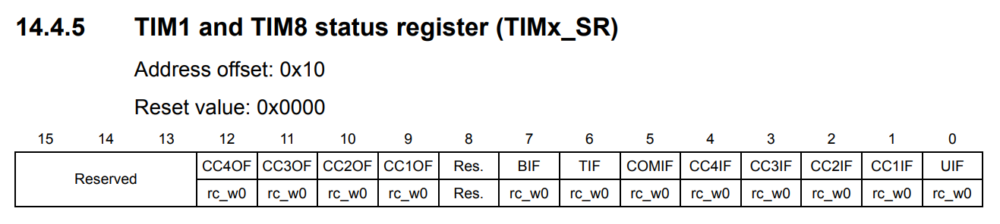

.. _section_timer:

Timer
=====


The source's **ClockInit** function focuses on configurations:

1. PLL multiplication factor = 9
2. Flash Latency = 2
3. APB low-speed prescaler (APB1) = 2

Link: https://github.com/ngminhthanh12a3/DESLabSTM32Training_TIMER/blob/main/Src/main.c#L52-L132

Timer Configuration
-------------------

This training material illustrated a **Timer Configuration** to create a 1000-milisecond delay for blinking **LED0**.  :math:`\mu s`- and :math:`ms`-level delay functions are provided from settings of **TIM1** block.

The **APB2** is set to 72MHz (:math:`f_{CK\_PSC}`). **Prescaler** configures **counter clock frequency** :math:`CK\_CNT` working at 1MHz. The **Prescaler** (PSC) is calculated as follows:

.. math::

   CK\_CNT = \frac{f_{CK\_PSC}}{PSC + 1}\\

.. math::

   \Leftrightarrow PSC + 1 = \frac{72MHz}{1MHz}

.. math::

   \Leftrightarrow PSC = 71


Enable TIM1 timer clock
```````````````````````

.. figure:: ../pics/W2_05-03-2024_19-52-47.png
   :align: center

   APB2 peripheral clock enable register (RCC_APB2ENR) (Source: \[[STM32_RM0008]_, page 112\])

.. code-block:: c

   // Bit 11 TIM1EN: TIM1 timer clock enable
   RCC->APB2ENR |= (1 << 11); // TIM1 timer clock enabled

Set Prescaler value
```````````````````


   TIMx prescaler (TIMx_PSC) (Source: \[[STM32_RM0008]_, page 418\])

.. code-block:: c

   // Bits 15:0 PSC[15:0]: Prescaler value
   TIM1->PSC = 72 - 1;

Set Auto-reload value
`````````````````````


   TIMx auto-reload register (TIMx_ARR) (Source: \[[STM32_RM0008]_, page 419\])

.. code-block:: c

   // Bits 15:0 ARR[15:0]: Auto-reload value
   TIM1->ARR = 0xffff - 1;

Enable couter
`````````````


   TIM1 and TIM8 control register 1 (TIMx_CR1) (Source: \[[STM32_RM0008]_, page 338\])

.. code-block:: c

   // Bit 0 CEN: Counter enable
   TIM1->CR1 |= (1 << 0); // Counter enabled

Check update interrupt flag
```````````````````````````



   TIM1 and TIM8 status register (TIMx_SR) (Source: \[[STM32_RM0008]_, page 346\])

.. code-block:: c

   // Bit 0 UIF: Update interrupt flag
   while(!(TIM1->SR & (1 << 0)));

Full Implementation Source
--------------------------

Link: https://github.com/ngminhthanh12a3/DESLabSTM32Training_TIMER/blob/main/Src/main.c
