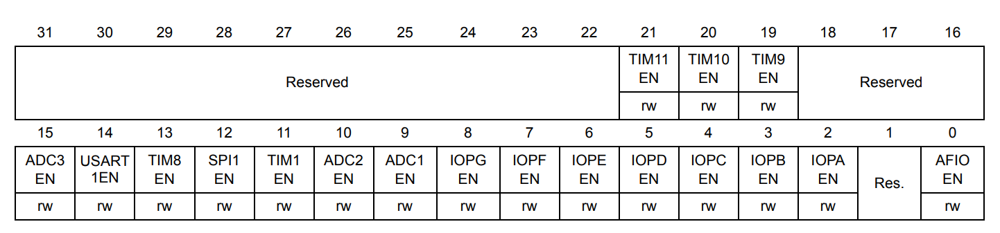

Universal synchronous asynchronous receiver transmitter (USART)
==================================================================

Using the USART1 hardware of the training board, set up the following parameters:

   - Baud rate: 115200 Bps
   - Data size: 8 bits
   - Parity bit: none
   - Stop bit: 1 bit
   - Pin PB6: USART1_TX
   - Pin PB7: USART1_RX


   USART1 hardware. (Source: Grape32 Unleased Kit Schematic \[[grape32_unleased_kit_sche]_\, page 1])

Conventional Setup
------------------

Enable clocks
`````````````



   APB2 peripheral clock enable register (RCC_APB2ENR) (Source: \[[STM32_RM0008]_, page 112\])

.. code-block:: c

   // Bit 0 AFIOEN: Alternate function IO clock enable
   // Bit 3 IOPBEN: IO port B clock enable
   // Bit 14 USART1EN: USART1 clock enable
   RCC->APB2ENR |= (1 << 0) | (1 << 3) | (1 << 14);

Config RX and TX Pins
`````````````````````

.. code-block:: c

   // Clear bit of PB16 and PB17
   GPIOB->CRL &= ~(0xff << 24);

   // Output mode, max speed 50 MHz.
   // Input mode (reset state)
   GPIOB->CRL |= (0b11 << 24) | (0b00 << 28);

   // Alternate function output Push-pull
   // Floating input (reset state)
   GPIOB->CRL |= (0b10 << 26) | (0b01 << 30);

Remap USART1 Pins
`````````````````


   AF remap and debug I/O configuration register (AFIO_MAPR) (Source: \[[STM32_RM0008]_, page 184\])

.. code-block:: c

   // Bit 2 USART1_REMAP: USART1 remapping
   AFIO->MAPR |= (1 << 2); // Remap (TX/PB6, RX/PB7)

USART1 Enable or Disable
````````````````````````


   Control register 1 (USART_CR1) (Source: \[[STM32_RM0008]_, page 821\])

.. code-block:: c

   // Bit 13 UE: USART enable
   USART1->CR1 &= ~(1 << 13); // USART prescaler and outputs disabled

   // Bit 13 UE: USART enable
   USART1->CR1 |= (1 << 13); // USART enabled

USART CR2 Configuration
```````````````````````


   Control register 2 (USART_CR2) (Source: \[[STM32_RM0008]_, page 823\])

.. code-block:: c

   /*-------------------------- USART CR2 Configuration -----------------------*/
   /* Configure the UART Stop Bits: Set STOP[13:12] bits
            according to huart->Init.StopBits value */
   // Bits 13:12 STOP: STOP bits
   USART1->CR2 &= ~(0b11 << 12); // 1 Stop bit

USART CR1 Configuration
```````````````````````

.. code-block:: c

   /*-------------------------- USART CR1 Configuration -----------------------*/
   /* Configure the UART Word Length, Parity and mode:
            Set the M bits
            Set PCE and PS bits
            Set TE and RE bits*/
   // Bit 12 M: Word length
   // Bit 10 PCE: Parity control enable
   // Bit 9 PS: Parity selection
   USART1->CR1 &= ~((1 << 12) | (1 << 10) | (1 << 9));

   // Bit 2 RE: Receiver enable
   // Bit 3 TE: Transmitter enable
   USART1->CR1 |= (1 << 2) | (1 << 3);

USART CR3 Configuration
```````````````````````


   Control register 3 (USART_CR3) (Source: \[[STM32_RM0008]_, page 824\])

.. code-block:: c

   /*-------------------------- USART CR3 Configuration -----------------------*/
   /* Configure the UART HFC: Set CTSE and RTSE bits according to huart->Init.HwFlowCtl value */
   // Bit 8 RTSE: RTS enable
   // Bit 9 CTSE: CTS enable
   USART1->CR3 &= ~((1 << 8) | (1 << 9));

USART BRR Configuration
```````````````````````


   Baud rate register (USART_BRR) (Source: \[[STM32_RM0008]_, page 820\])

.. code-block:: c

   /*-------------------------- USART BRR Configuration ---------------------*/
   USART1->BRR = 625; // 72M/115200 = 625

.. math::

   BRR = \frac{f_{CK}}{Baud Rate}

   \Leftrightarrow BRR = \frac{72MHz}{115200}

Asynchronous mode
`````````````````

.. code-block:: c

   /* In asynchronous mode, the following bits must be kept cleared:
            - LINEN and CLKEN bits in the USART_CR2 register,
            - SCEN, HDSEL and IREN  bits in the USART_CR3 register.*/
   // Bit 11 CLKEN: Clock enable
   // Bit 14 LINEN: LIN mode enable
   USART1->CR2 &= ~((1 << 11) | (1 << 14));

   // Bit 1 IREN: IrDA mode enable
   // Bit 3 HDSEL: Half-duplex selection
   // Bit 5 SCEN: Smartcard mode enable
   USART1->CR3 &= ~((1 << 1) | (1 << 3) | (1 << 5));

Receive a byte through USART
````````````````````````````

.. figure:: ../pics/W2_21-03-2024_11-2-57.png
   :align: center

   Status register (USART_SR) (Source: \[[STM32_RM0008]_, page 818\])


   Data register (USART_DR) (Source: \[[STM32_RM0008]_, page 820\])

.. code-block:: c

   uint8_t USART1_recByte()
   {
      // Bit 5 RXNE: Read data register not empty
      while(!(USART1->SR & (1 << 5)));

      // Bits 8:0 DR[8:0]: Data value
      return USART1->DR;
   }

Transmit a byte through USART
`````````````````````````````

.. code-block:: c

   void USART1_sendByte(uint8_t byte){
      USART1->DR = byte;

      // Bit 6 TC: Transmission complete
      while(!(USART1->SR & (1 << 6)));
      USART1->SR &= ~(1<<6); // clear TC flag
   }

Full Implementation Source
``````````````````````````

GitHub Link: https://github.com/DESLab-Resources/STM32Training_W3_Conv_USART

USART Interrupt
---------------

Enable the UART Error Interrupt
```````````````````````````````

.. code-block:: c

   /* Enable the UART Error Interrupt: (Frame error, noise error, overrun error) */
   // Bit 0 EIE: Error interrupt enable
   USART1->CR3 |= (1 << 0); // An interrupt is generated whenever DMAR=1 in the USART_CR3 register and FE=1 or ORE=1 or NE=1 in the USART_SR register.

Enable the UART Receive Interrupt
`````````````````````````````````

.. code-block:: c

   /* Enable the UART Data Register not empty Interrupt */
   // Bit 5 RXNEIE: RXNE interrupt enable
   USART1->CR1 |= (1 << 5); // A USART interrupt is generated whenever ORE=1 or RXNE=1 in the USART_SR register

USART1 interrupt Init
`````````````````````

.. code-block:: c

   /* USART1 interrupt Init */
   NVIC_SetPriority(USART1_IRQn, 0);
   NVIC_EnableIRQ(USART1_IRQn);

Setup the **USART1_IRQHandler**
```````````````````````````````

.. code-block:: c

   void USART1_IRQHandler()
   {
      uint8_t c = USART1->DR;

      USART1_sendByte(c);
   }

Full Implementation Source
``````````````````````````

GitHub Link: https://github.com/DESLab-Resources/STM32Training_W3_USART_Interrupt.git

Reference
---------

https://nicerland.com/eduFiles/STM32F103/PPts/10_USART.pps
