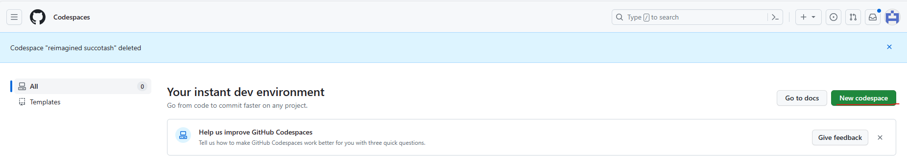
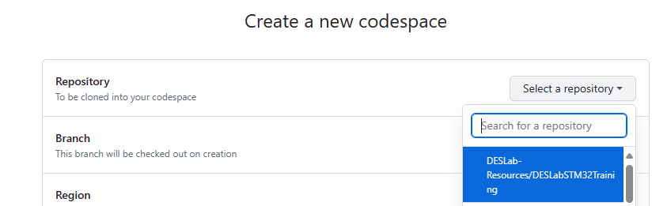
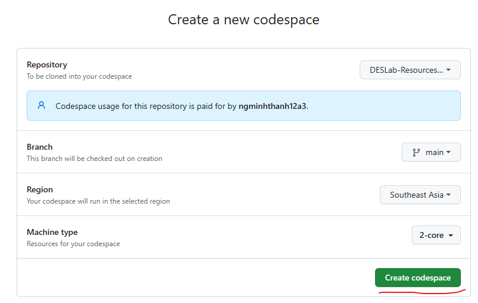
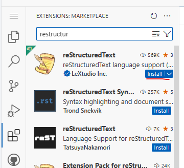
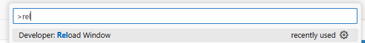

GitHub Codespaces
=================

Materials
---------

- `GitHub Codespaces <https://github.com/codespaces>`_

Create new codespaces
---------------------

   New codespace

   Codespaces' Repository

   Codespaces' Details

   reStructuredText Extension

Install Sphinx ReadtheDocs Theme
--------------------------------

.. code-block:: bash

   pip install sphinx-rtd-theme

Reload Window
-------------

Use keystroke: :code:`Ctrl + Shift + P`.

Image Name Generator
--------------------

Local generator with Excel.
