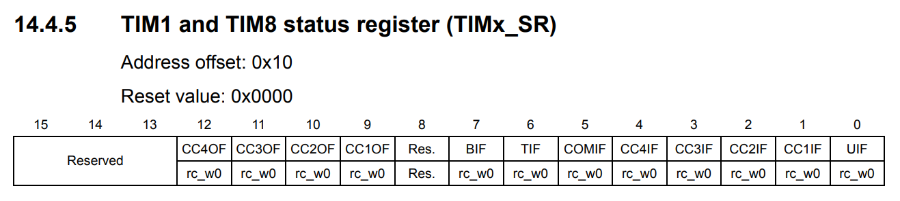
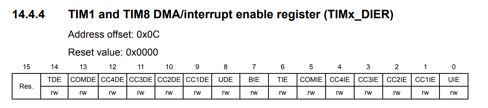

Timer Interrupt
===============

Derived from :ref:`Timer <section_timer>`

Clear Update Interrupt Flag
---------------------------

   TIM1 and TIM8 status register (TIMx_SR) (Source: \[[STM32_RM0008]_, page 346\])

.. code-block:: c

   // Clear UIF flag
   TIM1->SR = 0;

Enable Update Interrupt
-----------------------

   TIM1 and TIM8 DMA/interrupt enable register (TIMx_DIER) (Source: \[[STM32_RM0008]_, page 344\])

.. code-block:: c

   // Bit 0 UIE: Update interrupt enable
   TIM1->DIER |= (1 << 0); // Update interrupt enabled

Enable Pending Interrupt
------------------------

.. code-block:: c

   NVIC_EnableIRQ(TIM1_UP_IRQn);

Set up the **TIM1_UP_IRQHandler**
---------------------------------

.. code-block:: c

   void TIM1_UP_IRQHandler()
   {
      // ...
   }

Implementation Source
---------------------

GitHub Example Link: https://github.com/DESLab-Resources/EXT_TIMER_INTERRUPT

Reference
---------

https://nicerland.com/eduFiles/STM32F103/PPts/12_Interrupt.pps
